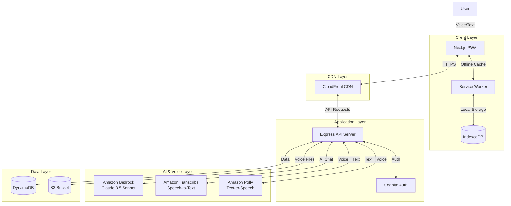
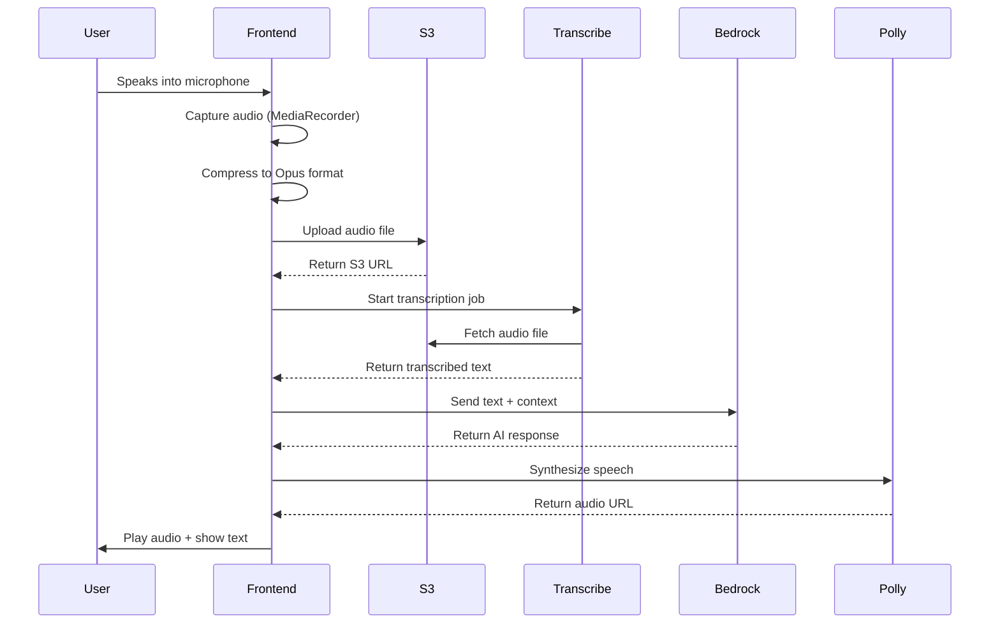

# Design Document: MudraGuru

## Overview

MudraGuru is an AI-powered, voice-first Progressive Web Application (PWA) designed to democratize access to Mudra Loans for non-tech-savvy small business owners across India. The system leverages AWS cloud services for AI capabilities, voice processing, and scalable infrastructure while maintaining an offline-first architecture to ensure functionality in low-connectivity environments.

The application follows a three-tier architecture: a Next.js frontend with PWA capabilities, a Node.js/Express backend API layer, and AWS managed services for AI, voice processing, and data storage. The design prioritizes simplicity, accessibility, and resilience to network failures.

## 1. System Architecture

### High-Level Architecture



### Component Breakdown

**Frontend Components:**
- Next.js 14 application with App Router
- React 18 components for UI
- Tailwind CSS for styling
- Service Worker for offline functionality
- IndexedDB for local data persistence
- MediaRecorder API for voice capture

**Backend Components:**
- Express.js REST API server
- TypeScript for type safety
- Middleware for authentication, logging, error handling
- AWS SDK integration for cloud services
- Rate limiting and request validation

**AI Layer:**
- Amazon Bedrock with Claude 3.5 Sonnet for conversational AI
- Context management for multi-turn dialogues
- Prompt engineering for Hindi/English responses
- Fallback mechanisms for service unavailability

**Voice Layer:**
- Amazon Transcribe for speech-to-text (Hindi, English)
- Amazon Polly for text-to-speech (Aditi voice for Hindi, Joanna for English)
- Audio compression and optimization
- Streaming support for real-time processing

**Database & Storage:**
- DynamoDB for structured data (users, sessions, eligibility)
- S3 for voice recordings and static assets
- IndexedDB for offline client-side storage
- CloudFront for content delivery

**Infrastructure:**
- AWS Amplify or EC2 for hosting
- CloudFront for CDN and edge caching
- AWS Cognito for authentication
- CloudWatch for monitoring and logging


### Data Flow

**Voice Interaction Flow:**
1. User speaks into device microphone
2. Frontend captures audio using MediaRecorder API
3. Audio compressed to Opus format
4. Audio uploaded to S3 temporary bucket
5. Backend triggers Amazon Transcribe with S3 URL
6. Transcribed text sent to Amazon Bedrock for AI processing
7. AI response generated in user's language
8. Response text sent to Amazon Polly for speech synthesis
9. Audio URL returned to frontend
10. Frontend plays audio and displays text simultaneously

**Eligibility Check Flow:**
1. User initiates eligibility check
2. Frontend loads questions from cache or API
3. User answers via voice or text
4. Responses validated and stored locally
5. After final question, data sent to backend
6. Backend processes eligibility logic
7. Result stored in DynamoDB
8. Recommendation returned to frontend
9. Frontend displays result and next steps

**Offline-to-Online Sync Flow:**
1. User performs actions while offline
2. Actions queued in IndexedDB
3. Service Worker detects network restoration
4. Background sync triggered
5. Queued actions sent to backend sequentially
6. Backend processes and stores in DynamoDB
7. Sync status updated in IndexedDB
8. User notified of successful sync

## 2. Technology Stack

### Frontend Stack
- **Framework:** Next.js 14 with App Router
- **UI Library:** React 18
- **Styling:** Tailwind CSS 3.x
- **Language:** TypeScript 5.x
- **State Management:** React Context API + useReducer
- **PWA:** next-pwa plugin with Workbox
- **HTTP Client:** Axios with retry logic
- **Audio Processing:** MediaRecorder API, Web Audio API
- **Local Storage:** IndexedDB via idb library
- **Form Validation:** Zod for schema validation

### Backend Stack
- **Runtime:** Node.js 18 LTS
- **Framework:** Express.js 4.x
- **Language:** TypeScript 5.x
- **AWS SDK:** AWS SDK v3 (modular)
- **Authentication:** AWS Cognito SDK
- **Validation:** Zod for request validation
- **Logging:** Winston with CloudWatch integration
- **Rate Limiting:** express-rate-limit
- **Compression:** compression middleware
- **Security:** helmet, cors, express-validator

### AI & Voice Services
- **Conversational AI:** Amazon Bedrock (Claude 3.5 Sonnet model)
- **Speech-to-Text:** Amazon Transcribe (Hindi: hi-IN, English: en-IN)
- **Text-to-Speech:** Amazon Polly (Hindi: Aditi voice, English: Joanna voice)
- **Language Detection:** AWS Comprehend (optional)

### Database & Storage
- **Primary Database:** Amazon DynamoDB (on-demand billing)
- **File Storage:** Amazon S3 (Standard-IA for voice recordings)
- **Client Storage:** IndexedDB (via idb wrapper)
- **Cache:** CloudFront edge caching

### Infrastructure & DevOps
- **Hosting:** AWS Amplify (frontend) + EC2/ECS (backend)
- **CDN:** CloudFront with custom domain
- **Authentication:** AWS Cognito User Pools
- **Monitoring:** CloudWatch Logs, Metrics, Alarms
- **Error Tracking:** CloudWatch Insights
- **CI/CD:** GitHub Actions
- **IaC:** AWS CDK or CloudFormation

## 3. API Design

### Base URL
```
Production: https://api.mudraguru.in
Development: https://dev-api.mudraguru.in
```

### Authentication
All endpoints except `/health` require JWT token in Authorization header:
```
Authorization: Bearer <jwt_token>
```

### API Endpoints

#### Session Management

**POST /api/session/start**

Start a new user session.

Request:
```json
{
  "phoneNumber": "+919876543210",
  "language": "hi"
}
```

Response:
```json
{
  "sessionId": "sess_abc123",
  "userId": "user_xyz789",
  "language": "hi",
  "timestamp": "2024-01-15T10:30:00Z"
}
```

**GET /api/session/:sessionId**

Retrieve session details.

Response:
```json
{
  "sessionId": "sess_abc123",
  "userId": "user_xyz789",
  "conversationContext": [...],
  "eligibilityData": {...},
  "lastActivity": "2024-01-15T10:35:00Z"
}
```

#### Voice Processing

**POST /api/voice/transcribe**

Transcribe audio to text.

Request (multipart/form-data):
```
audio: <audio_file>
language: "hi" | "en"
sessionId: "sess_abc123"
```

Response:
```json
{
  "transcriptionId": "trans_123",
  "text": "मुझे लोन की जानकारी चाहिए",
  "language": "hi",
  "confidence": 0.95
}
```

**POST /api/voice/synthesize**

Convert text to speech.

Request:
```json
{
  "text": "आपका स्वागत है",
  "language": "hi",
  "sessionId": "sess_abc123"
}
```

Response:
```json
{
  "audioUrl": "https://cdn.mudraguru.in/audio/abc123.mp3",
  "duration": 3.5,
  "expiresAt": "2024-01-15T11:00:00Z"
}
```

#### Conversational AI

**POST /api/chat/message**

Send message to AI assistant.

Request:
```json
{
  "sessionId": "sess_abc123",
  "message": "मुझे शिशु लोन के बारे में बताएं",
  "language": "hi",
  "context": {
    "currentStep": "loan_info",
    "userProfile": {...}
  }
}
```

Response:
```json
{
  "messageId": "msg_456",
  "response": "शिशु लोन 50,000 रुपये तक का लोन है...",
  "language": "hi",
  "suggestedActions": [
    {
      "label": "पात्रता जांचें",
      "action": "check_eligibility"
    }
  ],
  "audioUrl": "https://cdn.mudraguru.in/audio/response_456.mp3"
}
```

#### Eligibility Assessment

**POST /api/eligibility/check**

Check loan eligibility.

Request:
```json
{
  "sessionId": "sess_abc123",
  "responses": {
    "businessType": "retail",
    "monthlyIncome": 25000,
    "yearsInBusiness": 2,
    "hasGST": false,
    "loanPurpose": "expansion"
  }
}
```

Response:
```json
{
  "eligible": true,
  "recommendedCategory": "kishor",
  "maxLoanAmount": 500000,
  "reasoning": "आपकी मासिक आय और व्यवसाय अनुभव के आधार पर...",
  "nextSteps": [
    "आवेदन फॉर्म भरें",
    "नजदीकी बैंक शाखा खोजें"
  ]
}
```

**GET /api/eligibility/questions**

Get eligibility questions.

Query params: `?language=hi`

Response:
```json
{
  "questions": [
    {
      "id": "q1",
      "text": "आपका व्यवसाय किस प्रकार का है?",
      "type": "single_choice",
      "options": [
        {"value": "retail", "label": "खुदरा दुकान"},
        {"value": "service", "label": "सेवा व्यवसाय"},
        {"value": "manufacturing", "label": "विनिर्माण"}
      ]
    }
  ]
}
```


#### Loan Information

**GET /api/loans/categories**

Get loan category information.

Query params: `?language=hi`

Response:
```json
{
  "categories": [
    {
      "id": "shishu",
      "name": "शिशु",
      "maxAmount": 50000,
      "description": "छोटे व्यवसायों के लिए 50,000 रुपये तक का लोन",
      "examples": ["किराना दुकान शुरू करना", "सिलाई मशीन खरीदना"],
      "eligibility": ["कोई भी छोटा व्यवसाय", "कम से कम 6 महीने पुराना"]
    },
    {
      "id": "kishor",
      "name": "किशोर",
      "maxAmount": 500000,
      "description": "बढ़ते व्यवसायों के लिए 50,000 से 5 लाख रुपये तक",
      "examples": ["दुकान का विस्तार", "नई मशीनरी खरीदना"],
      "eligibility": ["स्थापित व्यवसाय", "नियमित आय"]
    },
    {
      "id": "tarun",
      "name": "तरुण",
      "maxAmount": 1000000,
      "description": "बड़े व्यवसायों के लिए 5 से 10 लाख रुपये तक",
      "examples": ["बड़ा विस्तार", "नई शाखा खोलना"],
      "eligibility": ["अच्छी तरह स्थापित व्यवसाय", "2+ साल का अनुभव"]
    }
  ]
}
```

#### Application Forms

**POST /api/forms/save-progress**

Save application form progress.

Request:
```json
{
  "sessionId": "sess_abc123",
  "formData": {
    "personalInfo": {
      "name": "राज कुमार",
      "phone": "+919876543210",
      "address": "123, मुख्य बाजार, दिल्ली"
    },
    "businessInfo": {
      "name": "राज किराना स्टोर",
      "type": "retail",
      "yearsInBusiness": 3
    }
  },
  "currentStep": "business_info",
  "completionPercentage": 45
}
```

Response:
```json
{
  "saved": true,
  "formId": "form_789",
  "lastSaved": "2024-01-15T10:40:00Z",
  "nextStep": "financial_info"
}
```

**GET /api/forms/:formId**

Retrieve saved form data.

Response:
```json
{
  "formId": "form_789",
  "formData": {...},
  "currentStep": "business_info",
  "completionPercentage": 45,
  "createdAt": "2024-01-15T10:00:00Z",
  "updatedAt": "2024-01-15T10:40:00Z"
}
```

#### Bank Branch Locator

**POST /api/branches/nearby**

Find nearby bank branches.

Request:
```json
{
  "latitude": 28.6139,
  "longitude": 77.2090,
  "radius": 5000,
  "limit": 5
}
```

Response:
```json
{
  "branches": [
    {
      "id": "branch_001",
      "bankName": "State Bank of India",
      "branchName": "Connaught Place",
      "address": "1, Parliament Street, New Delhi - 110001",
      "phone": "+91-11-23345678",
      "distance": 1200,
      "mudraLoanAvailable": true,
      "coordinates": {
        "latitude": 28.6289,
        "longitude": 77.2065
      }
    }
  ]
}
```

**GET /api/branches/cached**

Get cached branch data for offline use.

Query params: `?state=delhi&district=central`

Response:
```json
{
  "branches": [...],
  "lastUpdated": "2024-01-15T00:00:00Z",
  "cacheVersion": "v1.2"
}
```

#### Offline Sync

**POST /api/offline/sync**

Sync offline actions.

Request:
```json
{
  "userId": "user_xyz789",
  "actions": [
    {
      "actionId": "action_001",
      "type": "eligibility_response",
      "data": {...},
      "timestamp": "2024-01-15T10:30:00Z"
    },
    {
      "actionId": "action_002",
      "type": "form_progress",
      "data": {...},
      "timestamp": "2024-01-15T10:35:00Z"
    }
  ]
}
```

Response:
```json
{
  "synced": true,
  "results": [
    {
      "actionId": "action_001",
      "status": "success",
      "serverId": "elig_123"
    },
    {
      "actionId": "action_002",
      "status": "success",
      "serverId": "form_456"
    }
  ]
}
```

#### Health Check

**GET /api/health**

Check API health status.

Response:
```json
{
  "status": "healthy",
  "timestamp": "2024-01-15T10:45:00Z",
  "services": {
    "database": "up",
    "bedrock": "up",
    "transcribe": "up",
    "polly": "up",
    "s3": "up"
  }
}
```

## 4. Database Schema

### DynamoDB Tables

#### Table: Users

**Primary Key:** userId (String)

**Attributes:**
```typescript
{
  userId: string;              // PK: "user_abc123"
  phoneNumber: string;         // "+919876543210"
  preferredLanguage: string;   // "hi" | "en"
  createdAt: string;           // ISO 8601 timestamp
  lastLoginAt: string;         // ISO 8601 timestamp
  profile: {
    name?: string;
    businessType?: string;
    location?: {
      state: string;
      district: string;
    };
  };
  settings: {
    voiceEnabled: boolean;
    notifications: boolean;
  };
}
```

**GSI:** phoneNumber-index (for login lookup)

#### Table: Sessions

**Primary Key:** sessionId (String)

**Attributes:**
```typescript
{
  sessionId: string;           // PK: "sess_abc123"
  userId: string;              // "user_xyz789"
  conversationContext: Array<{
    role: "user" | "assistant";
    content: string;
    timestamp: string;
  }>;
  eligibilityData?: {
    responses: Record<string, any>;
    result?: {
      eligible: boolean;
      category: string;
      maxAmount: number;
    };
  };
  currentStep: string;         // "welcome" | "eligibility" | "application"
  language: string;            // "hi" | "en"
  createdAt: string;
  lastActivity: string;
  expiresAt: number;           // TTL for auto-deletion
}
```

**GSI:** userId-index (to find all sessions for a user)

#### Table: EligibilityResponses

**Primary Key:** responseId (String)

**Attributes:**
```typescript
{
  responseId: string;          // PK: "elig_abc123"
  sessionId: string;           // "sess_xyz789"
  userId: string;              // "user_123"
  responses: {
    businessType: string;
    monthlyIncome: number;
    yearsInBusiness: number;
    hasGST: boolean;
    loanPurpose: string;
  };
  result: {
    eligible: boolean;
    recommendedCategory: "shishu" | "kishor" | "tarun";
    maxLoanAmount: number;
    reasoning: string;
  };
  createdAt: string;
}
```

**GSI:** sessionId-index, userId-index

#### Table: ApplicationForms

**Primary Key:** formId (String)

**Attributes:**
```typescript
{
  formId: string;              // PK: "form_abc123"
  userId: string;              // "user_xyz789"
  sessionId: string;           // "sess_abc123"
  formData: {
    personalInfo: {
      name: string;
      fatherName: string;
      dateOfBirth: string;
      phone: string;
      email?: string;
      address: string;
      pincode: string;
      aadharNumber: string;
      panNumber?: string;
    };
    businessInfo: {
      name: string;
      type: string;
      registrationNumber?: string;
      yearsInBusiness: number;
      address: string;
      monthlyRevenue: number;
    };
    loanInfo: {
      category: string;
      amount: number;
      purpose: string;
    };
  };
  currentStep: string;
  completionPercentage: number;
  status: "draft" | "completed" | "submitted";
  createdAt: string;
  updatedAt: string;
}
```

**GSI:** userId-index, sessionId-index

#### Table: VoiceRecordings

**Primary Key:** recordingId (String)

**Attributes:**
```typescript
{
  recordingId: string;         // PK: "rec_abc123"
  sessionId: string;           // "sess_xyz789"
  userId: string;              // "user_123"
  s3Key: string;               // "recordings/2024/01/15/rec_abc123.opus"
  s3Bucket: string;            // "mudraguru-voice-recordings"
  duration: number;            // seconds
  language: string;            // "hi" | "en"
  transcription?: string;      // cached transcription
  createdAt: string;
  expiresAt: number;           // TTL: auto-delete after 30 days
}
```

**GSI:** sessionId-index, userId-index

#### Table: OfflineSyncQueue

**Primary Key:** queueId (String)

**Attributes:**
```typescript
{
  queueId: string;             // PK: "queue_abc123"
  userId: string;              // "user_xyz789"
  actionType: string;          // "eligibility" | "form_save" | "voice_upload"
  data: Record<string, any>;   // action-specific data
  syncStatus: "pending" | "synced" | "failed";
  retryCount: number;
  lastRetryAt?: string;
  createdAt: string;
  syncedAt?: string;
  expiresAt: number;           // TTL: delete after successful sync + 7 days
}
```

**GSI:** userId-syncStatus-index (to query pending syncs for a user)

#### Table: BankBranches

**Primary Key:** branchId (String)

**Attributes:**
```typescript
{
  branchId: string;            // PK: "branch_001"
  bankName: string;            // "State Bank of India"
  branchName: string;          // "Connaught Place"
  ifscCode: string;            // "SBIN0001234"
  address: string;
  city: string;
  state: string;
  pincode: string;
  phone: string;
  coordinates: {
    latitude: number;
    longitude: number;
  };
  mudraLoanAvailable: boolean;
  services: string[];          // ["shishu", "kishor", "tarun"]
  updatedAt: string;
}
```

**GSI:** state-city-index (for geographic queries)


### IndexedDB Schema (Client-Side)

#### Store: sessions

```typescript
{
  sessionId: string;           // key
  userId: string;
  conversationHistory: Array<Message>;
  language: string;
  lastSync: string;
}
```

#### Store: eligibilityCache

```typescript
{
  id: string;                  // key
  questions: Array<Question>;
  language: string;
  cachedAt: string;
}
```

#### Store: loanCategories

```typescript
{
  id: string;                  // key: "shishu" | "kishor" | "tarun"
  data: LoanCategory;
  language: string;
  cachedAt: string;
}
```

#### Store: formDrafts

```typescript
{
  formId: string;              // key
  formData: Record<string, any>;
  currentStep: string;
  lastSaved: string;
  syncStatus: "synced" | "pending";
}
```

#### Store: branchesCache

```typescript
{
  id: string;                  // key: "state_city"
  branches: Array<BankBranch>;
  cachedAt: string;
}
```

#### Store: syncQueue

```typescript
{
  queueId: string;             // key
  actionType: string;
  data: any;
  status: "pending" | "syncing" | "failed";
  retryCount: number;
  createdAt: string;
}
```

## 5. Frontend Architecture

### Next.js App Router Structure

```
src/
├── app/
│   ├── layout.tsx                 # Root layout with providers
│   ├── page.tsx                   # Home page (/)
│   ├── eligibility/
│   │   ├── page.tsx               # Eligibility checker
│   │   └── result/
│   │       └── page.tsx           # Eligibility result
│   ├── application/
│   │   ├── page.tsx               # Application form
│   │   └── [step]/
│   │       └── page.tsx           # Dynamic form steps
│   ├── branches/
│   │   └── page.tsx               # Bank branch locator
│   ├── loans/
│   │   └── page.tsx               # Loan categories info
│   ├── api/                       # API routes (if needed)
│   │   └── health/
│   │       └── route.ts
│   └── offline/
│       └── page.tsx               # Offline fallback page
├── components/
│   ├── ui/                        # Reusable UI components
│   │   ├── Button.tsx
│   │   ├── Card.tsx
│   │   ├── Input.tsx
│   │   ├── Select.tsx
│   │   ├── Modal.tsx
│   │   └── LoadingSpinner.tsx
│   ├── voice/                     # Voice-related components
│   │   ├── VoiceRecorder.tsx      # Voice input component
│   │   ├── VoicePlayer.tsx        # Audio playback component
│   │   ├── VoiceButton.tsx        # Mic button with animation
│   │   └── WaveformVisualizer.tsx # Audio waveform display
│   ├── chat/                      # Chat interface components
│   │   ├── ChatContainer.tsx
│   │   ├── ChatMessage.tsx
│   │   ├── ChatInput.tsx
│   │   └── SuggestedActions.tsx
│   ├── forms/                     # Form components
│   │   ├── FormStep.tsx
│   │   ├── FormProgress.tsx
│   │   ├── FormField.tsx
│   │   └── FormNavigation.tsx
│   ├── layout/                    # Layout components
│   │   ├── Header.tsx
│   │   ├── Footer.tsx
│   │   ├── Navigation.tsx
│   │   └── LanguageSelector.tsx
│   └── features/                  # Feature-specific components
│       ├── EligibilityQuiz.tsx
│       ├── LoanCategoryCard.tsx
│       ├── BranchCard.tsx
│       └── OfflineIndicator.tsx
├── contexts/                      # React Context providers
│   ├── AuthContext.tsx
│   ├── SessionContext.tsx
│   ├── LanguageContext.tsx
│   └── OfflineContext.tsx
├── hooks/                         # Custom React hooks
│   ├── useVoiceRecorder.ts
│   ├── useVoicePlayer.ts
│   ├── useChat.ts
│   ├── useEligibility.ts
│   ├── useOfflineSync.ts
│   ├── useGeolocation.ts
│   └── useIndexedDB.ts
├── lib/                           # Utility libraries
│   ├── api/                       # API client
│   │   ├── client.ts              # Axios instance with interceptors
│   │   ├── endpoints.ts           # API endpoint definitions
│   │   └── types.ts               # API request/response types
│   ├── db/                        # IndexedDB utilities
│   │   ├── schema.ts              # IndexedDB schema
│   │   ├── operations.ts          # CRUD operations
│   │   └── sync.ts                # Sync logic
│   ├── audio/                     # Audio processing
│   │   ├── recorder.ts            # Audio recording logic
│   │   ├── compressor.ts          # Audio compression
│   │   └── player.ts              # Audio playback logic
│   ├── i18n/                      # Internationalization
│   │   ├── translations.ts        # Translation strings
│   │   └── utils.ts               # i18n utilities
│   └── utils/                     # General utilities
│       ├── validation.ts          # Form validation
│       ├── formatting.ts          # Data formatting
│       └── storage.ts             # Storage helpers
├── types/                         # TypeScript type definitions
│   ├── api.ts
│   ├── models.ts
│   ├── components.ts
│   └── index.ts
├── styles/
│   └── globals.css                # Global styles with Tailwind
└── public/
    ├── manifest.json              # PWA manifest
    ├── icons/                     # App icons
    ├── audio/                     # Static audio files
    └── sw.js                      # Service Worker (generated)
```

### State Management Strategy

**Context API + useReducer Pattern:**

```typescript
// SessionContext for managing user session
interface SessionState {
  sessionId: string | null;
  userId: string | null;
  language: 'hi' | 'en';
  conversationHistory: Message[];
  currentStep: string;
}

// LanguageContext for managing language preferences
interface LanguageState {
  currentLanguage: 'hi' | 'en';
  translations: Record<string, string>;
}

// OfflineContext for managing offline state
interface OfflineState {
  isOnline: boolean;
  syncQueue: SyncAction[];
  lastSyncTime: string | null;
}
```

**Local Component State:**
- Use useState for simple UI state (modals, dropdowns)
- Use useReducer for complex form state
- Use custom hooks to encapsulate reusable logic

### Key Component Designs

#### VoiceRecorder Component

```typescript
interface VoiceRecorderProps {
  onRecordingComplete: (audioBlob: Blob) => void;
  language: 'hi' | 'en';
  maxDuration?: number;
}

// Features:
// - Visual feedback during recording
// - Waveform animation
// - Auto-stop at max duration
// - Error handling for mic permissions
// - Compression before upload
```

#### ChatContainer Component

```typescript
interface ChatContainerProps {
  sessionId: string;
  language: 'hi' | 'en';
  initialMessages?: Message[];
}

// Features:
// - Auto-scroll to latest message
// - Voice and text input modes
// - Suggested action buttons
// - Loading states
// - Offline message queuing
```

### PWA Configuration

**next.config.js with next-pwa:**

```javascript
const withPWA = require('next-pwa')({
  dest: 'public',
  register: true,
  skipWaiting: true,
  disable: process.env.NODE_ENV === 'development',
  runtimeCaching: [
    {
      urlPattern: /^https:\/\/api\.mudraguru\.in\/api\/.*/i,
      handler: 'NetworkFirst',
      options: {
        cacheName: 'api-cache',
        expiration: {
          maxEntries: 50,
          maxAgeSeconds: 5 * 60, // 5 minutes
        },
        networkTimeoutSeconds: 10,
      },
    },
    {
      urlPattern: /^https:\/\/cdn\.mudraguru\.in\/.*/i,
      handler: 'CacheFirst',
      options: {
        cacheName: 'static-cache',
        expiration: {
          maxEntries: 100,
          maxAgeSeconds: 30 * 24 * 60 * 60, // 30 days
        },
      },
    },
  ],
});

module.exports = withPWA({
  // Next.js config
});
```

**manifest.json:**

```json
{
  "name": "MudraGuru - Mudra Loan Assistant",
  "short_name": "MudraGuru",
  "description": "AI-powered voice assistant for Mudra Loans",
  "start_url": "/",
  "display": "standalone",
  "background_color": "#ffffff",
  "theme_color": "#FF6B35",
  "orientation": "portrait",
  "icons": [
    {
      "src": "/icons/icon-72x72.png",
      "sizes": "72x72",
      "type": "image/png"
    },
    {
      "src": "/icons/icon-192x192.png",
      "sizes": "192x192",
      "type": "image/png"
    },
    {
      "src": "/icons/icon-512x512.png",
      "sizes": "512x512",
      "type": "image/png"
    }
  ],
  "lang": "hi",
  "dir": "ltr"
}
```

### Service Worker Strategy

**Workbox Configuration:**

- **NetworkFirst** for API calls (try network, fallback to cache)
- **CacheFirst** for static assets (images, fonts, audio)
- **StaleWhileRevalidate** for loan category data
- **Background Sync** for offline form submissions
- **Precaching** for critical pages and assets


## 6. AI Integration Flow

### Amazon Bedrock Integration

**Model Configuration:**
- Model: Claude 3.5 Sonnet (anthropic.claude-3-5-sonnet-20240620-v1:0)
- Region: ap-south-1 (Mumbai) for lower latency
- Max tokens: 1024 for responses
- Temperature: 0.7 for conversational balance

**Prompt Engineering Strategy:**

```typescript
const systemPrompt = {
  hi: `आप MudraGuru हैं, एक सहायक AI जो भारत में छोटे व्यवसाय मालिकों को मुद्रा लोन के बारे में जानकारी देता है।

आपकी जिम्मेदारियां:
1. सरल हिंदी में जवाब दें (कठिन शब्दों से बचें)
2. मुद्रा लोन की तीन श्रेणियों को समझाएं: शिशु (₹50,000 तक), किशोर (₹5 लाख तक), तरुण (₹10 लाख तक)
3. पात्रता जांच में मदद करें
4. आवेदन प्रक्रिया में मार्गदर्शन करें
5. हमेशा सकारात्मक और प्रोत्साहित करने वाले रहें

नियम:
- छोटे वाक्य उपयोग करें
- उदाहरण दें (जैसे: "किराना दुकान के लिए")
- तकनीकी शब्दों को सरल भाषा में समझाएं
- अगर आप नहीं जानते, तो स्वीकार करें और बैंक से पूछने की सलाह दें`,

  en: `You are MudraGuru, a helpful AI assistant that provides information about Mudra Loans to small business owners in India.

Your responsibilities:
1. Answer in simple English (avoid jargon)
2. Explain the three Mudra Loan categories: Shishu (up to ₹50,000), Kishor (up to ₹5 lakh), Tarun (up to ₹10 lakh)
3. Help with eligibility checking
4. Guide through the application process
5. Always be positive and encouraging

Rules:
- Use short sentences
- Give examples (like: "for a grocery store")
- Explain technical terms in simple language
- If you don't know, admit it and suggest asking the bank`
};
```

**Conversation Context Management:**

```typescript
interface ConversationMessage {
  role: 'user' | 'assistant';
  content: string;
  timestamp: string;
}

// Keep last 10 messages for context
// Summarize older messages to save tokens
function buildContextWindow(history: ConversationMessage[]): string {
  const recentMessages = history.slice(-10);
  return recentMessages
    .map(msg => `${msg.role}: ${msg.content}`)
    .join('\n');
}
```

**Multi-Turn Dialogue Handling:**

1. **Context Preservation:** Store conversation history in session
2. **Intent Recognition:** Detect user intent (info, eligibility, application)
3. **State Tracking:** Track current step in user journey
4. **Clarification:** Ask follow-up questions when needed
5. **Handoff:** Transition to specific flows (eligibility checker, form)

**Language Detection and Switching:**

```typescript
async function detectLanguage(text: string): Promise<'hi' | 'en'> {
  // Check for Devanagari script
  const hindiPattern = /[\u0900-\u097F]/;
  if (hindiPattern.test(text)) {
    return 'hi';
  }
  
  // Use AWS Comprehend for ambiguous cases
  const comprehend = new ComprehendClient({ region: 'ap-south-1' });
  const result = await comprehend.send(
    new DetectDominantLanguageCommand({ Text: text })
  );
  
  const topLanguage = result.Languages?.[0];
  return topLanguage?.LanguageCode === 'hi' ? 'hi' : 'en';
}
```

**Response Formatting:**

```typescript
interface AIResponse {
  text: string;
  suggestedActions?: Array<{
    label: string;
    action: string;
    data?: any;
  }>;
  requiresInput?: boolean;
  nextStep?: string;
}

// Format response with action buttons
function formatResponse(rawResponse: string, context: SessionContext): AIResponse {
  // Parse AI response for action triggers
  // Add contextual action buttons
  // Determine next step in flow
}
```

**Fallback Handling:**

```typescript
async function callBedrockWithFallback(
  prompt: string,
  context: ConversationMessage[]
): Promise<string> {
  try {
    // Primary: Amazon Bedrock
    return await callBedrock(prompt, context);
  } catch (error) {
    if (error.code === 'ThrottlingException') {
      // Retry with exponential backoff
      await sleep(1000);
      return await callBedrock(prompt, context);
    }
    
    // Fallback: Rule-based responses
    return getRuleBasedResponse(prompt);
  }
}

function getRuleBasedResponse(prompt: string): string {
  // Simple keyword matching for common queries
  const keywords = {
    'शिशु': 'शिशु लोन 50,000 रुपये तक का लोन है...',
    'किशोर': 'किशोर लोन 50,000 से 5 लाख रुपये तक...',
    'पात्रता': 'पात्रता जांचने के लिए कुछ सवालों के जवाब दें...',
  };
  
  for (const [keyword, response] of Object.entries(keywords)) {
    if (prompt.includes(keyword)) {
      return response;
    }
  }
  
  return 'मुझे खेद है, मैं अभी आपकी मदद नहीं कर सकता। कृपया फिर से प्रयास करें।';
}
```

## 7. Voice Processing Pipeline

### Complete Voice Interaction Flow



### Audio Capture (Frontend)

```typescript
class VoiceRecorder {
  private mediaRecorder: MediaRecorder | null = null;
  private audioChunks: Blob[] = [];
  
  async startRecording(): Promise<void> {
    try {
      const stream = await navigator.mediaDevices.getUserMedia({
        audio: {
          echoCancellation: true,
          noiseSuppression: true,
          sampleRate: 16000, // Optimal for speech
        }
      });
      
      // Use Opus codec for compression
      const options = {
        mimeType: 'audio/webm;codecs=opus',
        audioBitsPerSecond: 16000, // Low bitrate for 2G
      };
      
      this.mediaRecorder = new MediaRecorder(stream, options);
      
      this.mediaRecorder.ondataavailable = (event) => {
        this.audioChunks.push(event.data);
      };
      
      this.mediaRecorder.start();
    } catch (error) {
      throw new Error('Microphone access denied');
    }
  }
  
  async stopRecording(): Promise<Blob> {
    return new Promise((resolve) => {
      if (!this.mediaRecorder) {
        throw new Error('No active recording');
      }
      
      this.mediaRecorder.onstop = () => {
        const audioBlob = new Blob(this.audioChunks, {
          type: 'audio/webm;codecs=opus'
        });
        this.audioChunks = [];
        resolve(audioBlob);
      };
      
      this.mediaRecorder.stop();
      this.mediaRecorder.stream.getTracks().forEach(track => track.stop());
    });
  }
}
```

### Audio Upload to S3

```typescript
async function uploadAudioToS3(
  audioBlob: Blob,
  sessionId: string
): Promise<string> {
  const fileName = `recordings/${new Date().toISOString().split('T')[0]}/${sessionId}_${Date.now()}.opus`;
  
  // Get presigned URL from backend
  const { uploadUrl, s3Key } = await api.post('/api/voice/upload-url', {
    fileName,
    contentType: 'audio/webm;codecs=opus',
  });
  
  // Upload directly to S3
  await fetch(uploadUrl, {
    method: 'PUT',
    body: audioBlob,
    headers: {
      'Content-Type': 'audio/webm;codecs=opus',
    },
  });
  
  return s3Key;
}
```

### Speech-to-Text (Amazon Transcribe)

```typescript
import { TranscribeClient, StartTranscriptionJobCommand } from '@aws-sdk/client-transcribe';

async function transcribeAudio(
  s3Key: string,
  language: 'hi' | 'en'
): Promise<string> {
  const client = new TranscribeClient({ region: 'ap-south-1' });
  
  const jobName = `transcribe_${Date.now()}`;
  const languageCode = language === 'hi' ? 'hi-IN' : 'en-IN';
  
  const command = new StartTranscriptionJobCommand({
    TranscriptionJobName: jobName,
    LanguageCode: languageCode,
    MediaFormat: 'webm',
    Media: {
      MediaFileUri: `s3://mudraguru-voice-recordings/${s3Key}`,
    },
    OutputBucketName: 'mudraguru-transcriptions',
    Settings: {
      ShowSpeakerLabels: false,
      MaxSpeakerLabels: 1,
    },
  });
  
  await client.send(command);
  
  // Poll for completion
  const transcription = await pollTranscriptionJob(client, jobName);
  return transcription;
}

async function pollTranscriptionJob(
  client: TranscribeClient,
  jobName: string
): Promise<string> {
  const maxAttempts = 30;
  const pollInterval = 2000; // 2 seconds
  
  for (let i = 0; i < maxAttempts; i++) {
    const { TranscriptionJob } = await client.send(
      new GetTranscriptionJobCommand({ TranscriptionJobName: jobName })
    );
    
    if (TranscriptionJob?.TranscriptionJobStatus === 'COMPLETED') {
      const transcriptUri = TranscriptionJob.Transcript?.TranscriptFileUri;
      const response = await fetch(transcriptUri!);
      const data = await response.json();
      return data.results.transcripts[0].transcript;
    }
    
    if (TranscriptionJob?.TranscriptionJobStatus === 'FAILED') {
      throw new Error('Transcription failed');
    }
    
    await sleep(pollInterval);
  }
  
  throw new Error('Transcription timeout');
}
```

### Text-to-Speech (Amazon Polly)

```typescript
import { PollyClient, SynthesizeSpeechCommand } from '@aws-sdk/client-polly';

async function synthesizeSpeech(
  text: string,
  language: 'hi' | 'en'
): Promise<string> {
  const client = new PollyClient({ region: 'ap-south-1' });
  
  // Select voice based on language
  const voiceId = language === 'hi' ? 'Aditi' : 'Joanna';
  
  const command = new SynthesizeSpeechCommand({
    Text: text,
    OutputFormat: 'mp3',
    VoiceId: voiceId,
    Engine: 'neural', // Higher quality
    LanguageCode: language === 'hi' ? 'hi-IN' : 'en-IN',
  });
  
  const response = await client.send(command);
  
  // Upload audio to S3 for CDN delivery
  const audioBuffer = await streamToBuffer(response.AudioStream);
  const s3Key = `responses/${Date.now()}.mp3`;
  
  await uploadToS3(audioBuffer, s3Key, 'audio/mpeg');
  
  // Return CDN URL
  return `https://cdn.mudraguru.in/${s3Key}`;
}
```

### Audio Playback (Frontend)

```typescript
class VoicePlayer {
  private audio: HTMLAudioElement | null = null;
  
  async play(audioUrl: string): Promise<void> {
    this.audio = new Audio(audioUrl);
    
    // Preload for faster playback
    this.audio.preload = 'auto';
    
    return new Promise((resolve, reject) => {
      this.audio!.onended = () => resolve();
      this.audio!.onerror = () => reject(new Error('Playback failed'));
      this.audio!.play();
    });
  }
  
  stop(): void {
    if (this.audio) {
      this.audio.pause();
      this.audio.currentTime = 0;
    }
  }
}
```

### Error Handling for Each Step

```typescript
interface VoiceProcessingError {
  step: 'capture' | 'upload' | 'transcribe' | 'ai' | 'synthesize' | 'playback';
  error: Error;
  userMessage: string;
}

function handleVoiceError(error: VoiceProcessingError): void {
  const errorMessages = {
    hi: {
      capture: 'माइक्रोफ़ोन एक्सेस की अनुमति दें',
      upload: 'अपलोड विफल। कृपया फिर से प्रयास करें',
      transcribe: 'आवाज़ समझने में समस्या। कृपया फिर से बोलें',
      ai: 'जवाब तैयार करने में समस्या। कृपया फिर से प्रयास करें',
      synthesize: 'आवाज़ तैयार करने में समस्या',
      playback: 'ऑडियो चलाने में समस्या',
    },
    en: {
      capture: 'Please allow microphone access',
      upload: 'Upload failed. Please try again',
      transcribe: 'Could not understand voice. Please speak again',
      ai: 'Error generating response. Please try again',
      synthesize: 'Error generating voice',
      playback: 'Error playing audio',
    },
  };
  
  // Show user-friendly error message
  // Log detailed error for debugging
  // Offer fallback (text input)
}
```


## 8. Security Architecture

### Authentication Strategy

**Phone Number + OTP Authentication:**

```typescript
// Using AWS Cognito Custom Auth Flow
async function initiateAuth(phoneNumber: string): Promise<void> {
  const cognito = new CognitoIdentityProviderClient({ region: 'ap-south-1' });
  
  // Send OTP via SMS
  await cognito.send(new InitiateAuthCommand({
    AuthFlow: 'CUSTOM_AUTH',
    ClientId: process.env.COGNITO_CLIENT_ID,
    AuthParameters: {
      USERNAME: phoneNumber,
    },
  }));
}

async function verifyOTP(phoneNumber: string, otp: string): Promise<string> {
  const cognito = new CognitoIdentityProviderClient({ region: 'ap-south-1' });
  
  const response = await cognito.send(new RespondToAuthChallengeCommand({
    ChallengeName: 'CUSTOM_CHALLENGE',
    ClientId: process.env.COGNITO_CLIENT_ID,
    ChallengeResponses: {
      USERNAME: phoneNumber,
      ANSWER: otp,
    },
  }));
  
  return response.AuthenticationResult?.IdToken!;
}
```

### Data Encryption

**In Transit (TLS 1.3):**
- All API communication over HTTPS
- Certificate from AWS Certificate Manager
- Enforce TLS 1.3 minimum version
- HSTS headers enabled

**At Rest (AES-256):**

```typescript
import { createCipheriv, createDecipheriv, randomBytes } from 'crypto';

class EncryptionService {
  private algorithm = 'aes-256-gcm';
  private key: Buffer;
  
  constructor(encryptionKey: string) {
    this.key = Buffer.from(encryptionKey, 'hex');
  }
  
  encrypt(data: string): { encrypted: string; iv: string; tag: string } {
    const iv = randomBytes(16);
    const cipher = createCipheriv(this.algorithm, this.key, iv);
    
    let encrypted = cipher.update(data, 'utf8', 'hex');
    encrypted += cipher.final('hex');
    
    const tag = cipher.getAuthTag();
    
    return {
      encrypted,
      iv: iv.toString('hex'),
      tag: tag.toString('hex'),
    };
  }
  
  decrypt(encrypted: string, iv: string, tag: string): string {
    const decipher = createDecipheriv(
      this.algorithm,
      this.key,
      Buffer.from(iv, 'hex')
    );
    
    decipher.setAuthTag(Buffer.from(tag, 'hex'));
    
    let decrypted = decipher.update(encrypted, 'hex', 'utf8');
    decrypted += decipher.final('utf8');
    
    return decrypted;
  }
}

// Encrypt sensitive fields before storing in DynamoDB
function encryptSensitiveData(formData: ApplicationForm): ApplicationForm {
  const encryption = new EncryptionService(process.env.ENCRYPTION_KEY!);
  
  return {
    ...formData,
    personalInfo: {
      ...formData.personalInfo,
      aadharNumber: encryption.encrypt(formData.personalInfo.aadharNumber),
      panNumber: formData.personalInfo.panNumber 
        ? encryption.encrypt(formData.personalInfo.panNumber)
        : undefined,
    },
  };
}
```

### API Security

**JWT Token Validation:**

```typescript
import jwt from 'jsonwebtoken';

interface JWTPayload {
  userId: string;
  phoneNumber: string;
  iat: number;
  exp: number;
}

function validateToken(token: string): JWTPayload {
  try {
    const decoded = jwt.verify(token, process.env.JWT_SECRET!) as JWTPayload;
    return decoded;
  } catch (error) {
    throw new Error('Invalid token');
  }
}

// Express middleware
function authMiddleware(req: Request, res: Response, next: NextFunction) {
  const authHeader = req.headers.authorization;
  
  if (!authHeader || !authHeader.startsWith('Bearer ')) {
    return res.status(401).json({ error: 'No token provided' });
  }
  
  const token = authHeader.substring(7);
  
  try {
    const payload = validateToken(token);
    req.user = payload;
    next();
  } catch (error) {
    return res.status(401).json({ error: 'Invalid token' });
  }
}
```

**Rate Limiting:**

```typescript
import rateLimit from 'express-rate-limit';

// General API rate limit
const apiLimiter = rateLimit({
  windowMs: 15 * 60 * 1000, // 15 minutes
  max: 100, // 100 requests per window
  message: 'Too many requests, please try again later',
  standardHeaders: true,
  legacyHeaders: false,
});

// Stricter limit for voice transcription (expensive operation)
const voiceLimiter = rateLimit({
  windowMs: 60 * 1000, // 1 minute
  max: 10, // 10 voice requests per minute
  message: 'Too many voice requests, please wait',
});

app.use('/api/', apiLimiter);
app.use('/api/voice/', voiceLimiter);
```

**Request Validation:**

```typescript
import { z } from 'zod';

const eligibilityRequestSchema = z.object({
  sessionId: z.string().uuid(),
  responses: z.object({
    businessType: z.enum(['retail', 'service', 'manufacturing', 'other']),
    monthlyIncome: z.number().min(0).max(10000000),
    yearsInBusiness: z.number().min(0).max(100),
    hasGST: z.boolean(),
    loanPurpose: z.string().min(1).max(500),
  }),
});

function validateRequest<T>(schema: z.ZodSchema<T>) {
  return (req: Request, res: Response, next: NextFunction) => {
    try {
      schema.parse(req.body);
      next();
    } catch (error) {
      if (error instanceof z.ZodError) {
        return res.status(400).json({
          error: 'Validation failed',
          details: error.errors,
        });
      }
      next(error);
    }
  };
}

app.post('/api/eligibility/check', 
  authMiddleware,
  validateRequest(eligibilityRequestSchema),
  handleEligibilityCheck
);
```

### Voice Recording Privacy

**Auto-Deletion Policy:**

```typescript
// DynamoDB TTL for automatic deletion after 30 days
async function saveVoiceRecording(recording: VoiceRecording): Promise<void> {
  const ttl = Math.floor(Date.now() / 1000) + (30 * 24 * 60 * 60); // 30 days
  
  await dynamodb.putItem({
    TableName: 'VoiceRecordings',
    Item: {
      ...recording,
      expiresAt: ttl, // TTL attribute
    },
  });
}

// S3 Lifecycle Policy for automatic deletion
const s3LifecyclePolicy = {
  Rules: [
    {
      Id: 'DeleteOldRecordings',
      Status: 'Enabled',
      Prefix: 'recordings/',
      Expiration: {
        Days: 30,
      },
    },
  ],
};
```

### PII Data Handling

**Data Minimization:**
- Collect only necessary information
- Don't store credit card or bank account details
- Hash phone numbers for analytics

**Data Access Controls:**
- User can only access their own data
- Admin access logged and audited
- No third-party data sharing

**User Data Deletion:**

```typescript
async function deleteUserData(userId: string): Promise<void> {
  // Delete from all tables
  await Promise.all([
    deleteFromTable('Users', { userId }),
    deleteFromTable('Sessions', { userId }),
    deleteFromTable('EligibilityResponses', { userId }),
    deleteFromTable('ApplicationForms', { userId }),
    deleteFromTable('VoiceRecordings', { userId }),
  ]);
  
  // Delete S3 objects
  const recordings = await listS3Objects(`recordings/${userId}/`);
  await deleteS3Objects(recordings);
  
  // Clear from IndexedDB (client-side)
  // User must clear browser data
}
```

### Compliance

**Indian Data Protection:**
- Data stored in ap-south-1 (Mumbai) region
- No cross-border data transfer
- User consent for data collection
- Privacy policy in Hindi and English

**Security Headers:**

```typescript
import helmet from 'helmet';

app.use(helmet({
  contentSecurityPolicy: {
    directives: {
      defaultSrc: ["'self'"],
      scriptSrc: ["'self'", "'unsafe-inline'"],
      styleSrc: ["'self'", "'unsafe-inline'"],
      imgSrc: ["'self'", 'data:', 'https://cdn.mudraguru.in'],
      connectSrc: ["'self'", 'https://api.mudraguru.in'],
      mediaSrc: ["'self'", 'https://cdn.mudraguru.in'],
    },
  },
  hsts: {
    maxAge: 31536000,
    includeSubDomains: true,
    preload: true,
  },
}));
```

## 9. Offline Strategy

### Service Worker Configuration

```typescript
// sw.js (generated by Workbox)
import { precacheAndRoute } from 'workbox-precaching';
import { registerRoute } from 'workbox-routing';
import { NetworkFirst, CacheFirst, StaleWhileRevalidate } from 'workbox-strategies';
import { BackgroundSyncPlugin } from 'workbox-background-sync';
import { ExpirationPlugin } from 'workbox-expiration';

// Precache critical assets
precacheAndRoute(self.__WB_MANIFEST);

// API calls: NetworkFirst with fallback
registerRoute(
  ({ url }) => url.pathname.startsWith('/api/'),
  new NetworkFirst({
    cacheName: 'api-cache',
    plugins: [
      new ExpirationPlugin({
        maxEntries: 50,
        maxAgeSeconds: 5 * 60, // 5 minutes
      }),
    ],
    networkTimeoutSeconds: 10,
  })
);

// Static assets: CacheFirst
registerRoute(
  ({ request }) => request.destination === 'image' || 
                   request.destination === 'font' ||
                   request.destination === 'style',
  new CacheFirst({
    cacheName: 'static-cache',
    plugins: [
      new ExpirationPlugin({
        maxEntries: 100,
        maxAgeSeconds: 30 * 24 * 60 * 60, // 30 days
      }),
    ],
  })
);

// Loan data: StaleWhileRevalidate
registerRoute(
  ({ url }) => url.pathname.includes('/api/loans/'),
  new StaleWhileRevalidate({
    cacheName: 'loan-data-cache',
    plugins: [
      new ExpirationPlugin({
        maxEntries: 20,
        maxAgeSeconds: 24 * 60 * 60, // 1 day
      }),
    ],
  })
);

// Background sync for offline actions
const bgSyncPlugin = new BackgroundSyncPlugin('offline-sync-queue', {
  maxRetentionTime: 24 * 60, // Retry for 24 hours
});

registerRoute(
  ({ url }) => url.pathname.includes('/api/forms/save-progress') ||
               url.pathname.includes('/api/eligibility/check'),
  new NetworkFirst({
    cacheName: 'sync-cache',
    plugins: [bgSyncPlugin],
  }),
  'POST'
);
```

### IndexedDB Schema for Offline Data

```typescript
import { openDB, DBSchema, IDBPDatabase } from 'idb';

interface MudraGuruDB extends DBSchema {
  sessions: {
    key: string;
    value: {
      sessionId: string;
      userId: string;
      conversationHistory: Message[];
      language: 'hi' | 'en';
      lastSync: string;
    };
  };
  eligibilityCache: {
    key: string;
    value: {
      id: string;
      questions: Question[];
      language: 'hi' | 'en';
      cachedAt: string;
    };
  };
  loanCategories: {
    key: string;
    value: {
      id: string;
      data: LoanCategory;
      language: 'hi' | 'en';
      cachedAt: string;
    };
  };
  formDrafts: {
    key: string;
    value: {
      formId: string;
      formData: Record<string, any>;
      currentStep: string;
      lastSaved: string;
      syncStatus: 'synced' | 'pending';
    };
  };
  branchesCache: {
    key: string;
    value: {
      id: string;
      branches: BankBranch[];
      cachedAt: string;
    };
  };
  syncQueue: {
    key: string;
    value: {
      queueId: string;
      actionType: string;
      data: any;
      status: 'pending' | 'syncing' | 'failed';
      retryCount: number;
      createdAt: string;
    };
    indexes: { 'by-status': string };
  };
}

async function initDB(): Promise<IDBPDatabase<MudraGuruDB>> {
  return openDB<MudraGuruDB>('mudraguru-db', 1, {
    upgrade(db) {
      // Create object stores
      db.createObjectStore('sessions', { keyPath: 'sessionId' });
      db.createObjectStore('eligibilityCache', { keyPath: 'id' });
      db.createObjectStore('loanCategories', { keyPath: 'id' });
      db.createObjectStore('formDrafts', { keyPath: 'formId' });
      db.createObjectStore('branchesCache', { keyPath: 'id' });
      
      const syncStore = db.createObjectStore('syncQueue', { keyPath: 'queueId' });
      syncStore.createIndex('by-status', 'status');
    },
  });
}
```

### Background Sync Logic

```typescript
class OfflineSyncManager {
  private db: IDBPDatabase<MudraGuruDB>;
  
  constructor(db: IDBPDatabase<MudraGuruDB>) {
    this.db = db;
    this.setupNetworkListener();
  }
  
  private setupNetworkListener(): void {
    window.addEventListener('online', () => {
      this.syncPendingActions();
    });
  }
  
  async queueAction(actionType: string, data: any): Promise<void> {
    const queueId = `queue_${Date.now()}_${Math.random()}`;
    
    await this.db.add('syncQueue', {
      queueId,
      actionType,
      data,
      status: 'pending',
      retryCount: 0,
      createdAt: new Date().toISOString(),
    });
    
    // Try to sync immediately if online
    if (navigator.onLine) {
      await this.syncPendingActions();
    }
  }
  
  async syncPendingActions(): Promise<void> {
    const pendingActions = await this.db.getAllFromIndex(
      'syncQueue',
      'by-status',
      'pending'
    );
    
    for (const action of pendingActions) {
      try {
        // Update status to syncing
        await this.db.put('syncQueue', {
          ...action,
          status: 'syncing',
        });
        
        // Send to server
        await this.syncAction(action);
        
        // Remove from queue on success
        await this.db.delete('syncQueue', action.queueId);
      } catch (error) {
        // Mark as failed and increment retry count
        await this.db.put('syncQueue', {
          ...action,
          status: 'failed',
          retryCount: action.retryCount + 1,
        });
      }
    }
  }
  
  private async syncAction(action: SyncAction): Promise<void> {
    const endpoints = {
      eligibility_response: '/api/eligibility/check',
      form_progress: '/api/forms/save-progress',
      voice_upload: '/api/voice/transcribe',
    };
    
    const endpoint = endpoints[action.actionType];
    if (!endpoint) {
      throw new Error(`Unknown action type: ${action.actionType}`);
    }
    
    await fetch(`${API_BASE_URL}${endpoint}`, {
      method: 'POST',
      headers: {
        'Content-Type': 'application/json',
        'Authorization': `Bearer ${getAuthToken()}`,
      },
      body: JSON.stringify(action.data),
    });
  }
}
```

### Network Detection

```typescript
class NetworkMonitor {
  private isOnline: boolean = navigator.onLine;
  private listeners: Array<(online: boolean) => void> = [];
  
  constructor() {
    this.setupListeners();
  }
  
  private setupListeners(): void {
    window.addEventListener('online', () => {
      this.isOnline = true;
      this.notifyListeners(true);
    });
    
    window.addEventListener('offline', () => {
      this.isOnline = false;
      this.notifyListeners(false);
    });
  }
  
  subscribe(callback: (online: boolean) => void): () => void {
    this.listeners.push(callback);
    
    // Return unsubscribe function
    return () => {
      this.listeners = this.listeners.filter(cb => cb !== callback);
    };
  }
  
  private notifyListeners(online: boolean): void {
    this.listeners.forEach(callback => callback(online));
  }
  
  getStatus(): boolean {
    return this.isOnline;
  }
}
```

### Cached Content Prioritization

```typescript
const CACHE_PRIORITIES = {
  critical: [
    '/api/loans/categories',
    '/api/eligibility/questions',
  ],
  important: [
    '/api/branches/cached',
  ],
  optional: [
    '/api/session/history',
  ],
};

async function precacheContent(): Promise<void> {
  const cache = await caches.open('mudraguru-cache-v1');
  
  // Cache critical content first
  for (const url of CACHE_PRIORITIES.critical) {
    try {
      const response = await fetch(url);
      await cache.put(url, response);
    } catch (error) {
      console.error(`Failed to cache ${url}:`, error);
    }
  }
  
  // Cache important content
  for (const url of CACHE_PRIORITIES.important) {
    try {
      const response = await fetch(url);
      await cache.put(url, response);
    } catch (error) {
      console.error(`Failed to cache ${url}:`, error);
    }
  }
}
```

### Conflict Resolution

```typescript
interface ConflictResolution {
  strategy: 'server-wins' | 'client-wins' | 'merge' | 'manual';
}

async function resolveConflict(
  clientData: any,
  serverData: any,
  strategy: ConflictResolution['strategy']
): Promise<any> {
  switch (strategy) {
    case 'server-wins':
      return serverData;
    
    case 'client-wins':
      return clientData;
    
    case 'merge':
      // Merge based on timestamps
      return {
        ...serverData,
        ...clientData,
        // Keep newer values for each field
      };
    
    case 'manual':
      // Show UI for user to resolve
      return await showConflictResolutionUI(clientData, serverData);
  }
}
```


## 10. Performance Optimization

### Code Splitting & Lazy Loading

```typescript
// Next.js dynamic imports for route-based code splitting
import dynamic from 'next/dynamic';

// Lazy load heavy components
const VoiceRecorder = dynamic(() => import('@/components/voice/VoiceRecorder'), {
  loading: () => <LoadingSpinner />,
  ssr: false, // Don't render on server
});

const BranchMap = dynamic(() => import('@/components/maps/BranchMap'), {
  loading: () => <LoadingSpinner />,
  ssr: false,
});

// Lazy load by route
const EligibilityPage = dynamic(() => import('@/app/eligibility/page'));
const ApplicationPage = dynamic(() => import('@/app/application/page'));
```

### Image Optimization

```typescript
// next.config.js
module.exports = {
  images: {
    formats: ['image/webp', 'image/avif'],
    deviceSizes: [640, 750, 828, 1080, 1200],
    imageSizes: [16, 32, 48, 64, 96, 128, 256],
    domains: ['cdn.mudraguru.in'],
    minimumCacheTTL: 60 * 60 * 24 * 30, // 30 days
  },
};

// Usage in components
import Image from 'next/image';

<Image
  src="/images/loan-illustration.png"
  alt="Mudra Loan"
  width={300}
  height={200}
  loading="lazy"
  placeholder="blur"
/>
```

### API Response Caching

```typescript
// Server-side caching with Redis (optional)
import { createClient } from 'redis';

const redis = createClient({
  url: process.env.REDIS_URL,
});

async function getCachedOrFetch<T>(
  key: string,
  fetcher: () => Promise<T>,
  ttl: number = 300
): Promise<T> {
  // Try cache first
  const cached = await redis.get(key);
  if (cached) {
    return JSON.parse(cached);
  }
  
  // Fetch and cache
  const data = await fetcher();
  await redis.setEx(key, ttl, JSON.stringify(data));
  
  return data;
}

// Usage
app.get('/api/loans/categories', async (req, res) => {
  const language = req.query.language as string;
  const cacheKey = `loan-categories:${language}`;
  
  const categories = await getCachedOrFetch(
    cacheKey,
    () => fetchLoanCategories(language),
    3600 // 1 hour
  );
  
  res.json({ categories });
});
```

### CloudFront CDN Configuration

```typescript
// CloudFormation template for CloudFront distribution
const cloudFrontDistribution = {
  Type: 'AWS::CloudFront::Distribution',
  Properties: {
    DistributionConfig: {
      Origins: [
        {
          Id: 'S3Origin',
          DomainName: 'mudraguru-static.s3.ap-south-1.amazonaws.com',
          S3OriginConfig: {
            OriginAccessIdentity: '',
          },
        },
        {
          Id: 'APIOrigin',
          DomainName: 'api.mudraguru.in',
          CustomOriginConfig: {
            HTTPSPort: 443,
            OriginProtocolPolicy: 'https-only',
          },
        },
      ],
      DefaultCacheBehavior: {
        TargetOriginId: 'S3Origin',
        ViewerProtocolPolicy: 'redirect-to-https',
        CachePolicyId: 'CachingOptimized',
        Compress: true,
      },
      CacheBehaviors: [
        {
          PathPattern: '/api/*',
          TargetOriginId: 'APIOrigin',
          ViewerProtocolPolicy: 'https-only',
          CachePolicyId: 'CachingDisabled',
        },
        {
          PathPattern: '/audio/*',
          TargetOriginId: 'S3Origin',
          ViewerProtocolPolicy: 'https-only',
          CachePolicyId: 'CachingOptimized',
          Compress: true,
        },
      ],
      PriceClass: 'PriceClass_200', // India, Asia, Europe
      Enabled: true,
    },
  },
};
```

### Database Query Optimization

```typescript
// Use DynamoDB batch operations
async function batchGetSessions(sessionIds: string[]): Promise<Session[]> {
  const params = {
    RequestItems: {
      Sessions: {
        Keys: sessionIds.map(id => ({ sessionId: id })),
      },
    },
  };
  
  const result = await dynamodb.batchGetItem(params);
  return result.Responses?.Sessions || [];
}

// Use GSI for efficient queries
async function getUserSessions(userId: string): Promise<Session[]> {
  const params = {
    TableName: 'Sessions',
    IndexName: 'userId-index',
    KeyConditionExpression: 'userId = :userId',
    ExpressionAttributeValues: {
      ':userId': userId,
    },
    Limit: 10,
    ScanIndexForward: false, // Most recent first
  };
  
  const result = await dynamodb.query(params);
  return result.Items as Session[];
}

// Use projection expressions to fetch only needed fields
async function getSessionSummary(sessionId: string): Promise<Partial<Session>> {
  const params = {
    TableName: 'Sessions',
    Key: { sessionId },
    ProjectionExpression: 'sessionId, userId, currentStep, lastActivity',
  };
  
  const result = await dynamodb.getItem(params);
  return result.Item as Partial<Session>;
}
```

### Voice File Compression

```typescript
// Opus codec configuration for optimal compression
const opusEncoderConfig = {
  sampleRate: 16000,      // 16kHz sufficient for speech
  channels: 1,            // Mono
  bitrate: 16000,         // 16kbps
  complexity: 5,          // Balance between quality and CPU
  frameSize: 20,          // 20ms frames
};

// Server-side compression for Polly responses
import ffmpeg from 'fluent-ffmpeg';

async function compressAudio(inputPath: string, outputPath: string): Promise<void> {
  return new Promise((resolve, reject) => {
    ffmpeg(inputPath)
      .audioCodec('libopus')
      .audioBitrate('16k')
      .audioChannels(1)
      .audioFrequency(16000)
      .output(outputPath)
      .on('end', resolve)
      .on('error', reject)
      .run();
  });
}
```

### Progressive Loading on 2G

```typescript
// Detect connection speed
function getConnectionSpeed(): 'slow-2g' | '2g' | '3g' | '4g' {
  const connection = (navigator as any).connection || 
                     (navigator as any).mozConnection || 
                     (navigator as any).webkitConnection;
  
  if (!connection) {
    return '4g'; // Assume fast if not available
  }
  
  return connection.effectiveType;
}

// Adjust behavior based on connection
function optimizeForConnection(): void {
  const speed = getConnectionSpeed();
  
  if (speed === 'slow-2g' || speed === '2g') {
    // Disable auto-play for voice responses
    disableAutoPlay();
    
    // Reduce image quality
    setImageQuality('low');
    
    // Disable animations
    disableAnimations();
    
    // Show text-only mode option
    showTextOnlyOption();
  }
}

// Progressive image loading
function loadImageProgressively(src: string, placeholder: string): void {
  const img = new Image();
  
  // Show placeholder first
  setImageSrc(placeholder);
  
  // Load full image in background
  img.onload = () => {
    setImageSrc(src);
  };
  
  img.src = src;
}
```

### Request Batching

```typescript
class RequestBatcher {
  private queue: Array<{ endpoint: string; data: any; resolve: Function }> = [];
  private timer: NodeJS.Timeout | null = null;
  
  add(endpoint: string, data: any): Promise<any> {
    return new Promise((resolve) => {
      this.queue.push({ endpoint, data, resolve });
      
      if (!this.timer) {
        this.timer = setTimeout(() => this.flush(), 100);
      }
    });
  }
  
  private async flush(): Promise<void> {
    if (this.queue.length === 0) return;
    
    const batch = this.queue.splice(0);
    this.timer = null;
    
    // Group by endpoint
    const grouped = batch.reduce((acc, item) => {
      if (!acc[item.endpoint]) {
        acc[item.endpoint] = [];
      }
      acc[item.endpoint].push(item);
      return acc;
    }, {} as Record<string, typeof batch>);
    
    // Send batched requests
    for (const [endpoint, items] of Object.entries(grouped)) {
      try {
        const response = await fetch(endpoint, {
          method: 'POST',
          headers: { 'Content-Type': 'application/json' },
          body: JSON.stringify({
            batch: items.map(i => i.data),
          }),
        });
        
        const results = await response.json();
        
        items.forEach((item, index) => {
          item.resolve(results[index]);
        });
      } catch (error) {
        items.forEach(item => item.resolve({ error }));
      }
    }
  }
}
```

## 11. Deployment Architecture

### CI/CD Pipeline (GitHub Actions)

```yaml
# .github/workflows/deploy.yml
name: Deploy MudraGuru

on:
  push:
    branches: [main, develop]
  pull_request:
    branches: [main]

env:
  AWS_REGION: ap-south-1
  NODE_VERSION: 18

jobs:
  test:
    runs-on: ubuntu-latest
    steps:
      - uses: actions/checkout@v3
      
      - name: Setup Node.js
        uses: actions/setup-node@v3
        with:
          node-version: ${{ env.NODE_VERSION }}
          cache: 'npm'
      
      - name: Install dependencies
        run: npm ci
      
      - name: Run linter
        run: npm run lint
      
      - name: Run type check
        run: npm run type-check
      
      - name: Run tests
        run: npm run test
      
      - name: Build
        run: npm run build

  deploy-frontend:
    needs: test
    if: github.ref == 'refs/heads/main'
    runs-on: ubuntu-latest
    steps:
      - uses: actions/checkout@v3
      
      - name: Setup Node.js
        uses: actions/setup-node@v3
        with:
          node-version: ${{ env.NODE_VERSION }}
      
      - name: Install dependencies
        run: npm ci
      
      - name: Build frontend
        run: npm run build
        env:
          NEXT_PUBLIC_API_URL: ${{ secrets.PROD_API_URL }}
      
      - name: Configure AWS credentials
        uses: aws-actions/configure-aws-credentials@v2
        with:
          aws-access-key-id: ${{ secrets.AWS_ACCESS_KEY_ID }}
          aws-secret-access-key: ${{ secrets.AWS_SECRET_ACCESS_KEY }}
          aws-region: ${{ env.AWS_REGION }}
      
      - name: Deploy to Amplify
        run: |
          aws amplify start-deployment \
            --app-id ${{ secrets.AMPLIFY_APP_ID }} \
            --branch-name main

  deploy-backend:
    needs: test
    if: github.ref == 'refs/heads/main'
    runs-on: ubuntu-latest
    steps:
      - uses: actions/checkout@v3
      
      - name: Configure AWS credentials
        uses: aws-actions/configure-aws-credentials@v2
        with:
          aws-access-key-id: ${{ secrets.AWS_ACCESS_KEY_ID }}
          aws-secret-access-key: ${{ secrets.AWS_SECRET_ACCESS_KEY }}
          aws-region: ${{ env.AWS_REGION }}
      
      - name: Login to Amazon ECR
        id: login-ecr
        uses: aws-actions/amazon-ecr-login@v1
      
      - name: Build and push Docker image
        env:
          ECR_REGISTRY: ${{ steps.login-ecr.outputs.registry }}
          ECR_REPOSITORY: mudraguru-backend
          IMAGE_TAG: ${{ github.sha }}
        run: |
          docker build -t $ECR_REGISTRY/$ECR_REPOSITORY:$IMAGE_TAG ./backend
          docker push $ECR_REGISTRY/$ECR_REPOSITORY:$IMAGE_TAG
      
      - name: Update ECS service
        run: |
          aws ecs update-service \
            --cluster mudraguru-cluster \
            --service mudraguru-backend \
            --force-new-deployment
```

### Environment Configuration

```typescript
// config/environments.ts
interface Environment {
  name: string;
  apiUrl: string;
  awsRegion: string;
  cognitoUserPoolId: string;
  cognitoClientId: string;
  s3Bucket: string;
  cdnUrl: string;
}

const environments: Record<string, Environment> = {
  development: {
    name: 'development',
    apiUrl: 'http://localhost:3001',
    awsRegion: 'ap-south-1',
    cognitoUserPoolId: 'ap-south-1_dev123',
    cognitoClientId: 'dev-client-id',
    s3Bucket: 'mudraguru-dev',
    cdnUrl: 'http://localhost:3000',
  },
  staging: {
    name: 'staging',
    apiUrl: 'https://staging-api.mudraguru.in',
    awsRegion: 'ap-south-1',
    cognitoUserPoolId: 'ap-south-1_staging123',
    cognitoClientId: 'staging-client-id',
    s3Bucket: 'mudraguru-staging',
    cdnUrl: 'https://staging-cdn.mudraguru.in',
  },
  production: {
    name: 'production',
    apiUrl: 'https://api.mudraguru.in',
    awsRegion: 'ap-south-1',
    cognitoUserPoolId: 'ap-south-1_prod123',
    cognitoClientId: 'prod-client-id',
    s3Bucket: 'mudraguru-prod',
    cdnUrl: 'https://cdn.mudraguru.in',
  },
};

export function getEnvironment(): Environment {
  const env = process.env.NODE_ENV || 'development';
  return environments[env];
}
```

### AWS Infrastructure Setup

```typescript
// infrastructure/cdk-stack.ts (AWS CDK)
import * as cdk from 'aws-cdk-lib';
import * as dynamodb from 'aws-cdk-lib/aws-dynamodb';
import * as s3 from 'aws-cdk-lib/aws-s3';
import * as cloudfront from 'aws-cdk-lib/aws-cloudfront';
import * as ecs from 'aws-cdk-lib/aws-ecs';
import * as cognito from 'aws-cdk-lib/aws-cognito';

export class MudraGuruStack extends cdk.Stack {
  constructor(scope: cdk.App, id: string, props?: cdk.StackProps) {
    super(scope, id, props);
    
    // DynamoDB Tables
    const usersTable = new dynamodb.Table(this, 'Users', {
      partitionKey: { name: 'userId', type: dynamodb.AttributeType.STRING },
      billingMode: dynamodb.BillingMode.PAY_PER_REQUEST,
      pointInTimeRecovery: true,
    });
    
    const sessionsTable = new dynamodb.Table(this, 'Sessions', {
      partitionKey: { name: 'sessionId', type: dynamodb.AttributeType.STRING },
      billingMode: dynamodb.BillingMode.PAY_PER_REQUEST,
      timeToLiveAttribute: 'expiresAt',
    });
    
    sessionsTable.addGlobalSecondaryIndex({
      indexName: 'userId-index',
      partitionKey: { name: 'userId', type: dynamodb.AttributeType.STRING },
    });
    
    // S3 Buckets
    const voiceBucket = new s3.Bucket(this, 'VoiceRecordings', {
      lifecycleRules: [
        {
          expiration: cdk.Duration.days(30),
        },
      ],
      cors: [
        {
          allowedMethods: [s3.HttpMethods.PUT, s3.HttpMethods.POST],
          allowedOrigins: ['https://mudraguru.in'],
          allowedHeaders: ['*'],
        },
      ],
    });
    
    // Cognito User Pool
    const userPool = new cognito.UserPool(this, 'UserPool', {
      signInAliases: { phone: true },
      selfSignUpEnabled: true,
      mfa: cognito.Mfa.OPTIONAL,
      mfaSecondFactor: { sms: true, otp: false },
    });
    
    // ECS Cluster for backend
    const cluster = new ecs.Cluster(this, 'Cluster', {
      clusterName: 'mudraguru-cluster',
    });
    
    // CloudFront Distribution
    const distribution = new cloudfront.Distribution(this, 'CDN', {
      defaultBehavior: {
        origin: new cloudfront.S3Origin(voiceBucket),
        viewerProtocolPolicy: cloudfront.ViewerProtocolPolicy.REDIRECT_TO_HTTPS,
      },
    });
  }
}
```

### Monitoring (CloudWatch)

```typescript
// monitoring/cloudwatch.ts
import { CloudWatchClient, PutMetricDataCommand } from '@aws-sdk/client-cloudwatch';

const cloudwatch = new CloudWatchClient({ region: 'ap-south-1' });

async function logMetric(
  metricName: string,
  value: number,
  unit: string = 'Count'
): Promise<void> {
  await cloudwatch.send(new PutMetricDataCommand({
    Namespace: 'MudraGuru',
    MetricData: [
      {
        MetricName: metricName,
        Value: value,
        Unit: unit,
        Timestamp: new Date(),
      },
    ],
  }));
}

// Usage in application
await logMetric('VoiceTranscriptionSuccess', 1);
await logMetric('EligibilityCheckCompleted', 1);
await logMetric('FormSubmission', 1);
await logMetric('APILatency', responseTime, 'Milliseconds');
```

### Error Tracking

```typescript
// monitoring/error-tracking.ts
import { CloudWatchLogsClient, PutLogEventsCommand } from '@aws-sdk/client-cloudwatch-logs';

const logsClient = new CloudWatchLogsClient({ region: 'ap-south-1' });

async function logError(error: Error, context: Record<string, any>): Promise<void> {
  const logEvent = {
    timestamp: Date.now(),
    message: JSON.stringify({
      error: {
        name: error.name,
        message: error.message,
        stack: error.stack,
      },
      context,
    }),
  };
  
  await logsClient.send(new PutLogEventsCommand({
    logGroupName: '/mudraguru/errors',
    logStreamName: 'application-errors',
    logEvents: [logEvent],
  }));
}

// Express error handler
app.use((err: Error, req: Request, res: Response, next: NextFunction) => {
  logError(err, {
    method: req.method,
    path: req.path,
    userId: req.user?.userId,
  });
  
  res.status(500).json({ error: 'Internal server error' });
});
```

### Auto-Scaling Configuration

```typescript
// infrastructure/autoscaling.ts
const autoScaling = {
  minCapacity: 2,
  maxCapacity: 10,
  targetCPUUtilization: 70,
  targetMemoryUtilization: 80,
  scaleInCooldown: 300, // 5 minutes
  scaleOutCooldown: 60,  // 1 minute
};

// ECS Service with auto-scaling
const service = new ecs.FargateService(this, 'BackendService', {
  cluster,
  taskDefinition,
  desiredCount: 2,
});

const scaling = service.autoScaleTaskCount({
  minCapacity: autoScaling.minCapacity,
  maxCapacity: autoScaling.maxCapacity,
});

scaling.scaleOnCpuUtilization('CpuScaling', {
  targetUtilizationPercent: autoScaling.targetCPUUtilization,
  scaleInCooldown: cdk.Duration.seconds(autoScaling.scaleInCooldown),
  scaleOutCooldown: cdk.Duration.seconds(autoScaling.scaleOutCooldown),
});
```


## 12. Project Folder Structure

### Complete Project Structure

```
mudraguru/
├── frontend/                          # Next.js frontend application
│   ├── src/
│   │   ├── app/                       # Next.js App Router
│   │   │   ├── layout.tsx
│   │   │   ├── page.tsx               # Home page
│   │   │   ├── globals.css
│   │   │   ├── eligibility/
│   │   │   │   ├── page.tsx
│   │   │   │   └── result/
│   │   │   │       └── page.tsx
│   │   │   ├── application/
│   │   │   │   ├── page.tsx
│   │   │   │   └── [step]/
│   │   │   │       └── page.tsx
│   │   │   ├── branches/
│   │   │   │   └── page.tsx
│   │   │   ├── loans/
│   │   │   │   └── page.tsx
│   │   │   └── offline/
│   │   │       └── page.tsx
│   │   ├── components/
│   │   │   ├── ui/
│   │   │   │   ├── Button.tsx
│   │   │   │   ├── Card.tsx
│   │   │   │   ├── Input.tsx
│   │   │   │   ├── Select.tsx
│   │   │   │   ├── Modal.tsx
│   │   │   │   └── LoadingSpinner.tsx
│   │   │   ├── voice/
│   │   │   │   ├── VoiceRecorder.tsx
│   │   │   │   ├── VoicePlayer.tsx
│   │   │   │   ├── VoiceButton.tsx
│   │   │   │   └── WaveformVisualizer.tsx
│   │   │   ├── chat/
│   │   │   │   ├── ChatContainer.tsx
│   │   │   │   ├── ChatMessage.tsx
│   │   │   │   ├── ChatInput.tsx
│   │   │   │   └── SuggestedActions.tsx
│   │   │   ├── forms/
│   │   │   │   ├── FormStep.tsx
│   │   │   │   ├── FormProgress.tsx
│   │   │   │   ├── FormField.tsx
│   │   │   │   └── FormNavigation.tsx
│   │   │   ├── layout/
│   │   │   │   ├── Header.tsx
│   │   │   │   ├── Footer.tsx
│   │   │   │   ├── Navigation.tsx
│   │   │   │   └── LanguageSelector.tsx
│   │   │   └── features/
│   │   │       ├── EligibilityQuiz.tsx
│   │   │       ├── LoanCategoryCard.tsx
│   │   │       ├── BranchCard.tsx
│   │   │       └── OfflineIndicator.tsx
│   │   ├── contexts/
│   │   │   ├── AuthContext.tsx
│   │   │   ├── SessionContext.tsx
│   │   │   ├── LanguageContext.tsx
│   │   │   └── OfflineContext.tsx
│   │   ├── hooks/
│   │   │   ├── useVoiceRecorder.ts
│   │   │   ├── useVoicePlayer.ts
│   │   │   ├── useChat.ts
│   │   │   ├── useEligibility.ts
│   │   │   ├── useOfflineSync.ts
│   │   │   ├── useGeolocation.ts
│   │   │   └── useIndexedDB.ts
│   │   ├── lib/
│   │   │   ├── api/
│   │   │   │   ├── client.ts
│   │   │   │   ├── endpoints.ts
│   │   │   │   └── types.ts
│   │   │   ├── db/
│   │   │   │   ├── schema.ts
│   │   │   │   ├── operations.ts
│   │   │   │   └── sync.ts
│   │   │   ├── audio/
│   │   │   │   ├── recorder.ts
│   │   │   │   ├── compressor.ts
│   │   │   │   └── player.ts
│   │   │   ├── i18n/
│   │   │   │   ├── translations.ts
│   │   │   │   └── utils.ts
│   │   │   └── utils/
│   │   │       ├── validation.ts
│   │   │       ├── formatting.ts
│   │   │       └── storage.ts
│   │   ├── types/
│   │   │   ├── api.ts
│   │   │   ├── models.ts
│   │   │   ├── components.ts
│   │   │   └── index.ts
│   │   └── styles/
│   │       └── globals.css
│   ├── public/
│   │   ├── manifest.json
│   │   ├── sw.js
│   │   ├── icons/
│   │   │   ├── icon-72x72.png
│   │   │   ├── icon-192x192.png
│   │   │   └── icon-512x512.png
│   │   ├── images/
│   │   └── audio/
│   ├── next.config.js
│   ├── tailwind.config.js
│   ├── tsconfig.json
│   ├── package.json
│   └── .env.local
│
├── backend/                           # Node.js/Express backend
│   ├── src/
│   │   ├── index.ts                   # Entry point
│   │   ├── app.ts                     # Express app setup
│   │   ├── server.ts                  # Server startup
│   │   ├── routes/
│   │   │   ├── index.ts
│   │   │   ├── session.routes.ts
│   │   │   ├── voice.routes.ts
│   │   │   ├── chat.routes.ts
│   │   │   ├── eligibility.routes.ts
│   │   │   ├── loans.routes.ts
│   │   │   ├── forms.routes.ts
│   │   │   ├── branches.routes.ts
│   │   │   └── sync.routes.ts
│   │   ├── controllers/
│   │   │   ├── session.controller.ts
│   │   │   ├── voice.controller.ts
│   │   │   ├── chat.controller.ts
│   │   │   ├── eligibility.controller.ts
│   │   │   ├── loans.controller.ts
│   │   │   ├── forms.controller.ts
│   │   │   ├── branches.controller.ts
│   │   │   └── sync.controller.ts
│   │   ├── services/
│   │   │   ├── bedrock.service.ts     # Amazon Bedrock integration
│   │   │   ├── transcribe.service.ts  # Amazon Transcribe integration
│   │   │   ├── polly.service.ts       # Amazon Polly integration
│   │   │   ├── s3.service.ts          # S3 operations
│   │   │   ├── dynamodb.service.ts    # DynamoDB operations
│   │   │   ├── cognito.service.ts     # Cognito auth
│   │   │   ├── eligibility.service.ts # Eligibility logic
│   │   │   └── encryption.service.ts  # Data encryption
│   │   ├── middleware/
│   │   │   ├── auth.middleware.ts
│   │   │   ├── validation.middleware.ts
│   │   │   ├── error.middleware.ts
│   │   │   ├── logging.middleware.ts
│   │   │   └── ratelimit.middleware.ts
│   │   ├── models/
│   │   │   ├── user.model.ts
│   │   │   ├── session.model.ts
│   │   │   ├── eligibility.model.ts
│   │   │   ├── form.model.ts
│   │   │   └── branch.model.ts
│   │   ├── utils/
│   │   │   ├── logger.ts
│   │   │   ├── errors.ts
│   │   │   ├── validation.ts
│   │   │   └── helpers.ts
│   │   ├── config/
│   │   │   ├── aws.config.ts
│   │   │   ├── database.config.ts
│   │   │   └── app.config.ts
│   │   └── types/
│   │       ├── api.types.ts
│   │       ├── models.types.ts
│   │       └── index.ts
│   ├── tests/
│   │   ├── unit/
│   │   ├── integration/
│   │   └── e2e/
│   ├── Dockerfile
│   ├── tsconfig.json
│   ├── package.json
│   └── .env
│
├── shared/                            # Shared types and utilities
│   ├── types/
│   │   ├── api.ts
│   │   ├── models.ts
│   │   └── index.ts
│   ├── constants/
│   │   ├── loan-categories.ts
│   │   └── error-codes.ts
│   └── utils/
│       └── validation.ts
│
├── infrastructure/                    # AWS CDK infrastructure code
│   ├── bin/
│   │   └── mudraguru.ts
│   ├── lib/
│   │   ├── mudraguru-stack.ts
│   │   ├── database-stack.ts
│   │   ├── storage-stack.ts
│   │   ├── compute-stack.ts
│   │   └── cdn-stack.ts
│   ├── cdk.json
│   ├── tsconfig.json
│   └── package.json
│
├── scripts/                           # Utility scripts
│   ├── seed-data.ts                   # Seed bank branches data
│   ├── migrate-db.ts                  # Database migrations
│   └── deploy.sh                      # Deployment script
│
├── .github/
│   └── workflows/
│       ├── deploy.yml
│       ├── test.yml
│       └── lint.yml
│
├── docs/                              # Documentation
│   ├── API.md
│   ├── DEPLOYMENT.md
│   ├── ARCHITECTURE.md
│   └── CONTRIBUTING.md
│
├── .gitignore
├── README.md
├── package.json                       # Root package.json for monorepo
└── turbo.json                         # Turborepo config (optional)
```

### Key Files Content

#### frontend/next.config.js

```javascript
const withPWA = require('next-pwa')({
  dest: 'public',
  register: true,
  skipWaiting: true,
  disable: process.env.NODE_ENV === 'development',
});

module.exports = withPWA({
  reactStrictMode: true,
  images: {
    formats: ['image/webp', 'image/avif'],
    domains: ['cdn.mudraguru.in'],
  },
  i18n: {
    locales: ['en', 'hi'],
    defaultLocale: 'hi',
  },
  env: {
    NEXT_PUBLIC_API_URL: process.env.NEXT_PUBLIC_API_URL,
    NEXT_PUBLIC_CDN_URL: process.env.NEXT_PUBLIC_CDN_URL,
  },
});
```

#### backend/Dockerfile

```dockerfile
FROM node:18-alpine AS builder

WORKDIR /app

COPY package*.json ./
RUN npm ci

COPY . .
RUN npm run build

FROM node:18-alpine

WORKDIR /app

COPY --from=builder /app/dist ./dist
COPY --from=builder /app/node_modules ./node_modules
COPY package*.json ./

EXPOSE 3001

CMD ["node", "dist/index.js"]
```

#### Root package.json (Monorepo)

```json
{
  "name": "mudraguru",
  "version": "1.0.0",
  "private": true,
  "workspaces": [
    "frontend",
    "backend",
    "shared",
    "infrastructure"
  ],
  "scripts": {
    "dev": "turbo run dev",
    "build": "turbo run build",
    "test": "turbo run test",
    "lint": "turbo run lint",
    "deploy": "turbo run deploy"
  },
  "devDependencies": {
    "turbo": "^1.10.0",
    "typescript": "^5.0.0"
  }
}
```

## Correctness Properties

*A property is a characteristic or behavior that should hold true across all valid executions of a system—essentially, a formal statement about what the system should do. Properties serve as the bridge between human-readable specifications and machine-verifiable correctness guarantees.*

Now I'll analyze the acceptance criteria to determine which are testable as properties:


### Property Reflection

After analyzing all acceptance criteria, I've identified the following redundancies and consolidations:

**Redundancies Identified:**
1. Properties 1.1 and 1.5 both test language support for voice - can be combined into one comprehensive property
2. Properties 6.2 and 6.5 both test cache content availability - can be merged
3. Properties 4.6 and 4.7 both test form persistence and resumption - these are complementary aspects of the same round-trip property
4. Properties 5.5 and 5.6 both test offline branch data access - can be combined
5. Properties 10.1 and 10.3 both test data security - can be consolidated into one property about sensitive data handling

**Properties to Combine:**
- Voice language support (1.1 + 1.5) → Single property about multi-language voice processing
- Cache functionality (6.2 + 6.5) → Single property about offline content availability
- Form persistence (4.6 + 4.7) → Single round-trip property for form state
- Branch offline access (5.5 + 5.6) → Single property about branch data caching
- Data security (10.1 + 10.3) → Single property about sensitive data protection

After consolidation, we have approximately 45 unique, non-redundant properties to implement.

### Correctness Properties

**Property 1: Multi-language voice transcription**
*For any* valid Hindi or English speech input, the Voice_Interface should successfully transcribe it to text in the correct language with sufficient accuracy for form completion
**Validates: Requirements 1.1, 1.5**

**Property 2: Text-to-speech synthesis**
*For any* text string in Hindi or English, the Voice_Interface should generate audio output
 in the selected language
**Validates: Requirements 1.2**

**Property 3: Voice input visual feedback**
*For any* voice recording session, the Voice_Interface should provide continuous visual feedback while the user is speaking
**Validates: Requirements 1.3**

**Property 4: Context preservation across input modes**
*For any* conversation, when a user switches between voice and text input, the conversation context should be maintained without loss
**Validates: Requirements 1.6**

**Property 5: Eligibility question limit**
*For any* eligibility check session, the Eligibility_Checker should ask no more than 5 questions
**Validates: Requirements 2.1**

**Property 6: Eligibility determination performance**
*For any* completed eligibility questionnaire, the Eligibility_Checker should determine eligibility status within 2 seconds
**Validates: Requirements 2.3**

**Property 7: Eligibility result recommendation**
*For any* eligible user, the Eligibility_Checker should recommend exactly one loan category (Shishu, Kishor, or Tarun)
**Validates: Requirements 2.4**

**Property 8: Eligibility result persistence**
*For any* eligibility check result, the result should be stored in the Offline_Store and retrievable later
**Validates: Requirements 2.6**

**Property 9: Loan category explanation availability**
*For any* loan category request, the MudraGuru_System should provide explanations for all three categories (Shishu, Kishor, Tarun) in the user's selected language
**Validates: Requirements 3.1, 3.4**

**Property 10: Sequential form field guidance**
*For any* application form, the Form_Assistant should guide the user through fields in a defined sequential order
**Validates: Requirements 4.1**

**Property 11: Form field validation feedback**
*For any* user input in a form field, the Form_Assistant should validate the input and provide immediate feedback
**Validates: Requirements 4.3**

**Property 12: Form auto-fill consistency**
*For any* previously provided information, the Form_Assistant should auto-fill relevant fields with the same data
**Validates: Requirements 4.5**

**Property 13: Form progress persistence (round-trip)**
*For any* form field completion, the data should be saved to Offline_Store, and when the user returns, the form should resume from the last completed field
**Validates: Requirements 4.6, 4.7**

**Property 14: Bank branch location limit**
*For any* bank location request, the Bank_Locator should display exactly 5 or fewer nearest bank branches
**Validates: Requirements 5.2**

**Property 15: Bank branch information completeness**
*For any* displayed bank branch, the Bank_Locator should show name, address, distance, and contact information
**Validates: Requirements 5.3**

**Property 16: Bank branch offline availability**
*For any* previously loaded bank branch data, the Bank_Locator should display cached information when network connectivity is unavailable
**Validates: Requirements 5.5, 5.6**

**Property 17: Offline core functionality**
*For any* application start without network connectivity, core features (eligibility questions, loan info, form drafts) should be available
**Validates: Requirements 6.1, 6.2, 6.5**

**Property 18: Offline action queuing**
*For any* user action completed offline, the action should be queued for synchronization
**Validates: Requirements 6.3**

**Property 19: Automatic sync on reconnection**
*For any* queued offline actions, when network connectivity is restored, the MudraGuru_System should automatically synchronize all queued data
**Validates: Requirements 6.4**

**Property 20: Initial load performance on 2G**
*For any* application load over 2G network, the MudraGuru_System should complete initial load within 10 seconds
**Validates: Requirements 7.1**

**Property 21: Language selection on first use**
*For any* first-time user, the MudraGuru_System should prompt for language selection (Hindi or English)
**Validates: Requirements 8.1**

**Property 22: Complete UI translation**
*For any* selected language, all interface text should be displayed in that language
**Validates: Requirements 8.2**

**Property 23: Language switching translation**
*For any* language switch, all current content should be translated to the new language
**Validates: Requirements 8.3**

**Property 24: Primary action limit per screen**
*For any* screen in the application, no more than 3 primary actions should be displayed
**Validates: Requirements 9.1**

**Property 25: Minimum font size**
*For any* text displayed in the application, the font size should be at least 16pt
**Validates: Requirements 9.2**

**Property 26: Immediate action feedback**
*For any* user action, the MudraGuru_System should provide immediate visual feedback
**Validates: Requirements 9.5**

**Property 27: Sensitive data encryption**
*For any* personal information (Aadhar, PAN), the data should be encrypted before storage and only stored on the user's device
**Validates: Requirements 10.1, 10.3**

**Property 28: Secure data transmission**
*For any* data transmitted over the network, the MudraGuru_System should use secure HTTPS connections
**Validates: Requirements 10.2**

**Property 29: User data deletion**
*For any* user data deletion request, all stored personal information should be removed within 24 hours
**Validates: Requirements 10.6**

### Property Testing Strategy

**Testing Framework:** 
- Use **fast-check** (JavaScript/TypeScript property-based testing library)
- Integrate with Jest for test execution
- Run properties against both frontend and backend components

**Test Data Generation:**
- Generate random Hindi and English text using Unicode ranges
- Generate valid phone numbers, Aadhar numbers, PAN numbers
- Generate realistic business data (income ranges, business types)
- Generate network condition simulations (2G, 3G, 4G, offline)

**Property Test Execution:**
- Run each property with 100+ random test cases
- Use shrinking to find minimal failing examples
- Test edge cases: empty inputs, maximum values, special characters
- Test concurrent operations for race conditions

**Coverage Goals:**
- 100% of acceptance criteria covered by properties
- All critical user flows tested
- All data transformations verified
- All error conditions handled

## 13. Testing Strategy

### Unit Testing

**Frontend Unit Tests (Jest + React Testing Library):**

```typescript
// Example: VoiceRecorder component test
import { render, screen, fireEvent, waitFor } from '@testing-library/react';
import { VoiceRecorder } from '@/components/voice/VoiceRecorder';

describe('VoiceRecorder', () => {
  it('should request microphone permission on start', async () => {
    const mockGetUserMedia = jest.fn().mockResolvedValue({
      getTracks: () => [],
    });
    
    global.navigator.mediaDevices = {
      getUserMedia: mockGetUserMedia,
    } as any;
    
    const onComplete = jest.fn();
    render(<VoiceRecorder onRecordingComplete={onComplete} language="hi" />);
    
    const startButton = screen.getByRole('button', { name: /start/i });
    fireEvent.click(startButton);
    
    await waitFor(() => {
      expect(mockGetUserMedia).toHaveBeenCalledWith({
        audio: expect.objectContaining({
          echoCancellation: true,
          noiseSuppression: true,
        }),
      });
    });
  });
  
  it('should compress audio before upload', async () => {
    // Test audio compression logic
  });
});
```

**Backend Unit Tests (Jest):**

```typescript
// Example: Eligibility service test
import { EligibilityService } from '@/services/eligibility.service';

describe('EligibilityService', () => {
  let service: EligibilityService;
  
  beforeEach(() => {
    service = new EligibilityService();
  });
  
  it('should recommend Shishu for income < 10000', () => {
    const result = service.checkEligibility({
      businessType: 'retail',
      monthlyIncome: 8000,
      yearsInBusiness: 1,
      hasGST: false,
      loanPurpose: 'equipment',
    });
    
    expect(result.eligible).toBe(true);
    expect(result.recommendedCategory).toBe('shishu');
    expect(result.maxLoanAmount).toBe(50000);
  });
  
  it('should recommend Kishor for income 10000-50000', () => {
    const result = service.checkEligibility({
      businessType: 'service',
      monthlyIncome: 25000,
      yearsInBusiness: 2,
      hasGST: false,
      loanPurpose: 'expansion',
    });
    
    expect(result.eligible).toBe(true);
    expect(result.recommendedCategory).toBe('kishor');
    expect(result.maxLoanAmount).toBe(500000);
  });
});
```

### Integration Testing

**API Integration Tests:**

```typescript
// Example: Voice transcription flow test
import request from 'supertest';
import { app } from '@/app';

describe('Voice Transcription Flow', () => {
  it('should transcribe Hindi audio to text', async () => {
    // Upload audio file
    const uploadResponse = await request(app)
      .post('/api/voice/upload-url')
      .set('Authorization', `Bearer ${testToken}`)
      .send({
        fileName: 'test-audio.opus',
        contentType: 'audio/webm;codecs=opus',
      });
    
    expect(uploadResponse.status).toBe(200);
    const { uploadUrl, s3Key } = uploadResponse.body;
    
    // Simulate S3 upload
    await uploadAudioToS3(uploadUrl, testAudioBlob);
    
    // Request transcription
    const transcribeResponse = await request(app)
      .post('/api/voice/transcribe')
      .set('Authorization', `Bearer ${testToken}`)
      .send({
        s3Key,
        language: 'hi',
        sessionId: testSessionId,
      });
    
    expect(transcribeResponse.status).toBe(200);
    expect(transcribeResponse.body.text).toBeTruthy();
    expect(transcribeResponse.body.language).toBe('hi');
  });
});
```

### Property-Based Testing

**Example Property Tests:**

```typescript
import fc from 'fast-check';

describe('Property: Multi-language voice transcription', () => {
  it('should transcribe any valid Hindi or English text', async () => {
    await fc.assert(
      fc.asyncProperty(
        fc.oneof(
          fc.string({ minLength: 10, maxLength: 200 }), // English
          fc.unicodeString({ minLength: 10, maxLength: 200 }) // Hindi
        ),
        fc.constantFrom('hi', 'en'),
        async (text, language) => {
          // Generate speech from text
          const audioBlob = await synthesizeSpeech(text, language);
          
          // Transcribe back to text
          const transcription = await transcribeAudio(audioBlob, language);
          
          // Check similarity (allowing for transcription errors)
          const similarity = calculateSimilarity(text, transcription);
          expect(similarity).toBeGreaterThan(0.8); // 80% accuracy threshold
        }
      ),
      { numRuns: 100 }
    );
  });
});

describe('Property: Eligibility question limit', () => {
  it('should never ask more than 5 questions', async () => {
    await fc.assert(
      fc.asyncProperty(
        fc.record({
          businessType: fc.constantFrom('retail', 'service', 'manufacturing'),
          monthlyIncome: fc.integer({ min: 0, max: 1000000 }),
          yearsInBusiness: fc.integer({ min: 0, max: 50 }),
          hasGST: fc.boolean(),
          loanPurpose: fc.string({ minLength: 5, maxLength: 100 }),
        }),
        async (responses) => {
          const questions = await getEligibilityQuestions();
          expect(questions.length).toBeLessThanOrEqual(5);
        }
      ),
      { numRuns: 100 }
    );
  });
});

describe('Property: Form progress persistence', () => {
  it('should preserve and restore form state', async () => {
    await fc.assert(
      fc.asyncProperty(
        fc.record({
          personalInfo: fc.record({
            name: fc.string({ minLength: 2, maxLength: 100 }),
            phone: fc.string({ minLength: 10, maxLength: 13 }),
            address: fc.string({ minLength: 10, maxLength: 200 }),
          }),
          businessInfo: fc.record({
            name: fc.string({ minLength: 2, maxLength: 100 }),
            type: fc.constantFrom('retail', 'service', 'manufacturing'),
            yearsInBusiness: fc.integer({ min: 0, max: 50 }),
          }),
        }),
        async (formData) => {
          // Save form progress
          const formId = await saveFormProgress(formData, 'business_info');
          
          // Retrieve form
          const retrieved = await getFormProgress(formId);
          
          // Verify data integrity
          expect(retrieved.formData).toEqual(formData);
          expect(retrieved.currentStep).toBe('business_info');
        }
      ),
      { numRuns: 50 }
    );
  });
});

describe('Property: Offline action queuing and sync', () => {
  it('should queue offline actions and sync when online', async () => {
    await fc.assert(
      fc.asyncProperty(
        fc.array(
          fc.record({
            actionType: fc.constantFrom('eligibility_response', 'form_progress'),
            data: fc.object(),
          }),
          { minLength: 1, maxLength: 10 }
        ),
        async (actions) => {
          // Simulate offline mode
          setNetworkStatus('offline');
          
          // Queue actions
          for (const action of actions) {
            await queueOfflineAction(action.actionType, action.data);
          }
          
          // Verify actions are queued
          const queuedActions = await getPendingActions();
          expect(queuedActions.length).toBe(actions.length);
          
          // Simulate online mode
          setNetworkStatus('online');
          
          // Trigger sync
          await syncOfflineActions();
          
          // Verify queue is empty
          const remainingActions = await getPendingActions();
          expect(remainingActions.length).toBe(0);
        }
      ),
      { numRuns: 20 }
    );
  });
});
```

### End-to-End Testing

**E2E Tests (Playwright):**

```typescript
import { test, expect } from '@playwright/test';

test.describe('Complete Eligibility Flow', () => {
  test('should complete eligibility check via voice', async ({ page }) => {
    await page.goto('/');
    
    // Select language
    await page.click('text=हिंदी');
    
    // Start eligibility check
    await page.click('text=पात्रता जांचें');
    
    // Answer questions via voice (simulated)
    await page.click('[data-testid="voice-button"]');
    await simulateVoiceInput(page, 'खुदरा दुकान');
    
    await page.click('[data-testid="voice-button"]');
    await simulateVoiceInput(page, 'पच्चीस हजार रुपये');
    
    // Continue through all questions
    // ...
    
    // Verify result
    await expect(page.locator('text=आप पात्र हैं')).toBeVisible();
    await expect(page.locator('text=किशोर')).toBeVisible();
  });
});

test.describe('Offline Functionality', () => {
  test('should work offline and sync when online', async ({ page, context }) => {
    await page.goto('/');
    
    // Load initial data
    await page.waitForLoadState('networkidle');
    
    // Go offline
    await context.setOffline(true);
    
    // Fill eligibility form
    await page.click('text=Check Eligibility');
    await page.fill('[name="businessType"]', 'retail');
    await page.fill('[name="monthlyIncome"]', '25000');
    await page.click('text=Submit');
    
    // Verify offline indicator
    await expect(page.locator('[data-testid="offline-indicator"]')).toBeVisible();
    
    // Go online
    await context.setOffline(false);
    
    // Wait for sync
    await page.waitForSelector('[data-testid="sync-complete"]');
    
    // Verify data was synced
    const response = await page.request.get('/api/eligibility/check');
    expect(response.ok()).toBeTruthy();
  });
});
```

### Performance Testing

**Load Testing (Artillery):**

```yaml
# artillery-config.yml
config:
  target: 'https://api.mudraguru.in'
  phases:
    - duration: 60
      arrivalRate: 10
      name: "Warm up"
    - duration: 300
      arrivalRate: 50
      name: "Sustained load"
    - duration: 120
      arrivalRate: 100
      name: "Peak load"
  
scenarios:
  - name: "Voice transcription flow"
    flow:
      - post:
          url: "/api/voice/upload-url"
          headers:
            Authorization: "Bearer {{ token }}"
          json:
            fileName: "test.opus"
            contentType: "audio/webm"
      - post:
          url: "/api/voice/transcribe"
          headers:
            Authorization: "Bearer {{ token }}"
          json:
            s3Key: "{{ s3Key }}"
            language: "hi"
  
  - name: "Eligibility check"
    flow:
      - post:
          url: "/api/eligibility/check"
          headers:
            Authorization: "Bearer {{ token }}"
          json:
            responses:
              businessType: "retail"
              monthlyIncome: 25000
              yearsInBusiness: 2
```

### Security Testing

**Security Test Cases:**

```typescript
describe('Security Tests', () => {
  it('should reject requests without authentication', async () => {
    const response = await request(app)
      .get('/api/session/sess_123');
    
    expect(response.status).toBe(401);
  });
  
  it('should prevent SQL injection in form inputs', async () => {
    const maliciousInput = "'; DROP TABLE Users; --";
    
    const response = await request(app)
      .post('/api/forms/save-progress')
      .set('Authorization', `Bearer ${testToken}`)
      .send({
        formData: {
          personalInfo: {
            name: maliciousInput,
          },
        },
      });
    
    expect(response.status).toBe(400);
  });
  
  it('should encrypt sensitive data before storage', async () => {
    const formData = {
      personalInfo: {
        aadharNumber: '123456789012',
        panNumber: 'ABCDE1234F',
      },
    };
    
    await saveFormData(formData);
    
    // Retrieve from database directly
    const stored = await getFromDatabase('ApplicationForms', formId);
    
    // Verify data is encrypted
    expect(stored.personalInfo.aadharNumber).not.toBe('123456789012');
    expect(stored.personalInfo.aadharNumber).toMatch(/^[a-f0-9]+$/); // Hex string
  });
});
```

## 14. Deployment Checklist

### Pre-Deployment

- [ ] All unit tests passing
- [ ] All integration tests passing
- [ ] All property-based tests passing
- [ ] E2E tests passing
- [ ] Security audit completed
- [ ] Performance benchmarks met
- [ ] Code review completed
- [ ] Documentation updated
- [ ] Environment variables configured
- [ ] AWS resources provisioned
- [ ] Database migrations prepared
- [ ] Backup strategy in place

### Deployment Steps

1. **Database Setup**
   - Create DynamoDB tables
   - Set up GSI indexes
   - Configure TTL attributes
   - Seed initial data (bank branches)

2. **Storage Setup**
   - Create S3 buckets
   - Configure lifecycle policies
   - Set up CORS rules
   - Configure CloudFront distribution

3. **Authentication Setup**
   - Create Cognito User Pool
   - Configure custom auth flow
   - Set up SMS provider for OTP

4. **Backend Deployment**
   - Build Docker image
   - Push to ECR
   - Deploy to ECS/Fargate
   - Configure auto-scaling
   - Set up load balancer
   - Configure health checks

5. **Frontend Deployment**
   - Build Next.js application
   - Deploy to Amplify
   - Configure custom domain
   - Set up SSL certificate
   - Configure CDN

6. **Monitoring Setup**
   - Configure CloudWatch alarms
   - Set up error tracking
   - Configure log aggregation
   - Set up performance monitoring

### Post-Deployment

- [ ] Smoke tests passed
- [ ] Health check endpoints responding
- [ ] SSL certificate valid
- [ ] CDN caching working
- [ ] Voice services operational
- [ ] AI services operational
- [ ] Database connections stable
- [ ] Monitoring dashboards active
- [ ] Alerts configured
- [ ] Backup verification
- [ ] Performance metrics baseline established
- [ ] User acceptance testing completed

### Rollback Plan

1. Keep previous version running during deployment
2. Use blue-green deployment strategy
3. Monitor error rates for 1 hour post-deployment
4. If error rate > 5%, trigger automatic rollback
5. Rollback steps:
   - Switch traffic back to previous version
   - Investigate issues
   - Fix and redeploy

## 15. Maintenance and Monitoring

### Key Metrics to Monitor

**Application Metrics:**
- API response time (p50, p95, p99)
- Error rate by endpoint
- Request rate
- Active users
- Session duration
- Voice transcription success rate
- AI response generation time
- Form completion rate
- Offline sync success rate

**Infrastructure Metrics:**
- CPU utilization
- Memory utilization
- Network throughput
- Database read/write capacity
- S3 storage usage
- CloudFront cache hit rate
- ECS task count

**Business Metrics:**
- Daily active users
- Eligibility checks completed
- Applications started
- Applications completed
- Bank branches viewed
- Language preference distribution
- Average session duration

### Alerting Rules

```typescript
// CloudWatch Alarms
const alarms = [
  {
    name: 'HighErrorRate',
    metric: 'ErrorCount',
    threshold: 10,
    period: 300, // 5 minutes
    evaluationPeriods: 2,
    action: 'SendSNSNotification',
  },
  {
    name: 'HighAPILatency',
    metric: 'APILatency',
    threshold: 2000, // 2 seconds
    period: 300,
    evaluationPeriods: 3,
    action: 'SendSNSNotification',
  },
  {
    name: 'LowCacheHitRate',
    metric: 'CacheHitRate',
    threshold: 0.7, // 70%
    period: 3600, // 1 hour
    evaluationPeriods: 1,
    action: 'SendSNSNotification',
  },
];
```

### Maintenance Tasks

**Daily:**
- Review error logs
- Check system health
- Monitor performance metrics
- Review user feedback

**Weekly:**
- Analyze usage patterns
- Review cost optimization opportunities
- Update documentation
- Security patch review

**Monthly:**
- Performance optimization review
- Capacity planning
- Security audit
- Backup verification
- Disaster recovery drill

### Scaling Strategy

**Horizontal Scaling:**
- Auto-scale ECS tasks based on CPU/memory
- Scale DynamoDB capacity based on read/write patterns
- Add CloudFront edge locations as needed

**Vertical Scaling:**
- Upgrade ECS task definitions for more resources
- Optimize database queries
- Implement caching layers

**Cost Optimization:**
- Use DynamoDB on-demand billing
- Implement S3 lifecycle policies
- Use CloudFront for static content
- Optimize Lambda function memory
- Review and remove unused resources

## Conclusion

This design document provides a comprehensive blueprint for building MudraGuru, an AI-powered voice-first PWA for democratizing access to Mudra Loans in India. The architecture prioritizes:

1. **Accessibility**: Voice-first interface with multi-language support
2. **Resilience**: Offline-first design with automatic sync
3. **Performance**: Optimized for 2G networks and low-bandwidth scenarios
4. **Security**: End-to-end encryption and secure data handling
5. **Scalability**: Cloud-native architecture with auto-scaling
6. **Correctness**: Property-based testing for formal verification

The system leverages modern web technologies (Next.js, React, TypeScript) combined with AWS managed services (Bedrock, Transcribe, Polly, DynamoDB, S3) to deliver a robust, scalable solution that can serve millions of small business owners across India.

By following this design, the development team can build a system that not only meets the technical requirements but also delivers real value to users who need it most—empowering small business owners to access financial support for growth.
